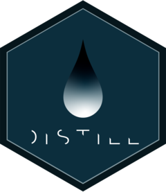

<!-- README.md is generated from README.Rmd. Please edit that file -->

# distill for R Markdown <a href="https://pkgs.rstudio.com/distill/"></a>

<!-- badges: start -->

[](https://CRAN.R-project.org/package=distill)
[](https://github.com/rstudio/distill/actions/workflows/R-CMD-check.yaml)
[](https://app.codecov.io/gh/rstudio/distill?branch=main)

<!-- badges: end -->

Distill for R Markdown is a web publishing format optimized for
scientific and technical communication. Distill articles include:

- Reader-friendly typography that adapts well to mobile devices.
- Features essential to technical writing like LaTeX math, citations,
  and footnotes.
- Flexible figure layout options (e.g. displaying figures at a larger
  width than the article text).
- Attractively rendered tables with optional support for pagination.
- Support for a wide variety of diagramming tools for illustrating
  concepts.
- The ability to incorporate JavaScript and D3-based interactive
  visualizations.
- A variety of ways to publish articles, including support for
  publishing collections or articles as a Distill website.

Distill for R Markdown is based on the [Distill web
framework](https://github.com/distillpub/template), which was originally
created for use in the Distill Machine Learning Journal. Distill for R
Markdown combines the technical authoring features of Distill with [R
Markdown](https://rmarkdown.rstudio.com/), enabling a fully reproducible
workflow based on literate programming.

## Installation

Install the released version of distill from CRAN:

``` r
install.packages("distill")
```

Or install the development version from GitHub with:

``` r
# install.packages("pak")
pak::pak("rstudio/distill")
```

Learn more about using Distill at <https://rstudio.github.io/distill/>.

## Get help

The [RStudio community](https://community.rstudio.com/tag/distill) is a
friendly place to ask any questions about distill.

## Code of Conduct

Please note that the distill project is released with a [Contributor
Code of Conduct](https://pkgs.rstudio.com/distill/CODE_OF_CONDUCT.html).
By contributing to this project, you agree to abide by its terms.
