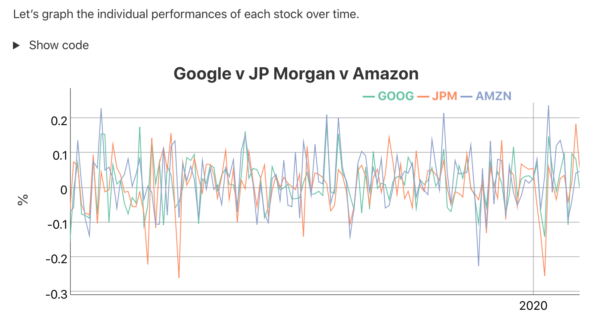

## Creating an article

To create an [R Markdown](https://rmarkdown.rstudio.com) document that uses the Distill format, first install the **distill** R package from CRAN:

```{r, eval=FALSE, echo=TRUE}
install.packages("distill")
```

Then, use the **New R Markdown** dialog within RStudio to create a new Distill article:

{.screenshot width="100%"}

You can also create a new Distill article from the command line with:

```{r, eval=FALSE, echo=TRUE}
library(distill)
create_article("article.Rmd")
```

Distill articles use `distill::distill_article` as their output format, and typically include title, description, date, author/affiliation, and bibliography entries in their YAML front-matter:

``` yaml
---
title: "Distill for R Markdown"
description: | 
  Scientific and technical writing, native to the web
date: May 4, 2018
author:
  - first_name: "Yihui"
    last_name: "Xie"
    url: https://github.com/yihui
    affiliation: Posit Software, PBC
    affiliation_url: https://www.posit.co
    orcid_id: 0000-0003-0645-5666
  - name: "JJ Allaire"
    url: https://github.com/jjallaire
    affiliation: Posit Software, PBC
    affiliation_url: https://www.posit.co
  - name: "Rich Iannone"
    url: https://github.com/rich-iannone
    affiliation: Posit Software, PBC
    affiliation_url: https://www.posit.co
bibliography: biblio.bib
output: distill::distill_article
---
```

Author names can be specified using explicit `first_name` and `last_name` fields or with a single `name` field. Author entries must have at least a name and `url` specified (the affiliation fields are optional). Specify an author's [Orcid ID](https://orcid.org/) using the `orcid_id` field.

The article's description and author bylines are automatically rendered as part of the title area of the document.

The `date` field should be formatted either as month, day, year or as year, month, day (various notations are supported as long as the components appear in one of these orders).

The `bibliography` field is used to provide a reference to the Bibtex file where all of the sources cited in your article are defined. The [citations] section describes how to include references to these sources in your article.

## Figures

Distill provides a number of options for laying out figures within your article. By default figures span the width of the main article body:


However, some figures benefit from using additional horizontal space. In this cases the `layout` chunk option enables you to specify a wide variety of other layouts.

For example, if we wanted to display a figure a bit outside the bounds of the article text, we could specify the `l-body-outset` layout via the `layout` chunk option:

```` clike
```{r, layout="l-body-outset", fig.width=6, fig.height=1.5}`r ''`
library(ggplot2)
ggplot(diamonds, aes(carat, price)) + geom_smooth() +
  facet_grid(~ cut)
```
````

::: l-body-outset
{style="width: 100%"}
:::

Note that when specifying an alternate `layout` you should also specify an appropriate `fig.width` and `fig.height` for that layout. These values don't determine the absolute size of the figure (that's dynamic based on the layout) but they do determine the aspect ratio of the figure.

See the documentation on [figure layout](figures.html) for details on additional layout options.

The examples above are based on conventional R plots. Distill articles can also incorporate [diagrams](diagrams.html) and [interactive visualizations](interactivity.html) based on JavaScript and D3.

## Tables

There are a number of options available for HTML display of data frames within Distill articles. Here, we use the `paged_table()` function to display a page-able view of the `mtcars` dataset built in to R:

```` clike
```{r, layout="l-body-outset"}`r ''`
library(rmarkdown)
paged_table(mtcars)
```
````

```{r, layout="l-body-outset"}
library(rmarkdown)
paged_table(mtcars)
```

Note that we used `layout="l-body-outset"` to cause the table to occupy slightly more horizontal space than the article text. All of available [figure layout options](figures.html) work as expected for tables.

See the documentation on [table display](tables.html) for details on the various techniques available for rendering tables.

## Equations

Inline and display equations are supported via standard markdown [MathJax](https://www.mathjax.org/) syntax. For example, the following [LaTeX math](https://en.wikibooks.org/wiki/LaTeX/Mathematics):

```         
$$
\sigma = \sqrt{ \frac{1}{N} \sum_{i=1}^N (x_i -\mu)^2}
$$
```

Will be rendered as:

$$
\sigma = \sqrt{ \frac{1}{N} \sum_{i=1}^N (x_i -\mu)^2}
$$

## Citations

Bibtex is the supported way of making academic citations. To include citations, first create a bibtex file and refer to it from the `bibliography` field of the YAML front-matter (as [illustrated above](#front-matter)).

For example, your bibliography file might contain:

``` bibtex
@Book{xie2015,
  title = {Dynamic Documents with R and knitr},
  author = {Yihui Xie},
  publisher = {Chapman and Hall/CRC},
  address = {Boca Raton, Florida},
  year = {2015},
  edition = {2nd},
  note = {ISBN 978-1498716963},
  url = {http://yihui.name/knitr/},
}
```

Citations are then used in the article body with standard R Markdown notation, for example: `[@xie2015]` (which references an id provided in the bibliography). Note that multiple ids (separated by semicolons) can be provided.

The citation is presented inline like this: [@xie2015]. If you have an appendix, a bibliography is automatically created and populated in it.

See the article on [citations](citations.html) for additional details on using citations, including how to provide the metadata required to make your article more easily citable for others.

## Footnotes and asides

Footnotes use standard Pandoc markdown notation, for example `^[This will become a hover-able footnote]`. The number of the footnote will be automatically generated. [^distill_basics-1]

[^distill_basics-1]: This will become a hover-able footnote

You can also optionally include notes in the gutter of the article (immediately to the right of the article text). To do this use the `<aside>` tag.

``` html
<aside>
This content will appear in the gutter of the article.
</aside>
```

<aside>This content will appear in the gutter of the article.</aside>

You can also include figures in the gutter. Just enclose the code chunk which generates the figure in an `<aside>` tag:

```` clike
<aside>
```{r}`r ''`
ggplot(mtcars, aes(hp, mpg)) + geom_point() + geom_smooth()
```
</aside>
````

<aside>{width="100%"}</aside>

## Table of contents

You can add a table of contents using the `toc` option and specify the depth of headers that it applies to using the `toc_depth` option. For example:

``` yaml
---
title: "Distill for R Markdown"
description: | 
  Scientific and technical writing, native to the web
output:
  distill::distill_article:
    toc: true
    toc_depth: 2
---
```

If the table of contents depth is not explicitly specified, it defaults to 3 (meaning that all level 1, 2, and 3 headers will be included in the table of contents).

The table of contents will automatically float to the left when the article is displayed at more than 1000px wide. To always show the table of contents on top specify `toc_float: false`:

``` yaml
output:
  distill::distill_article:
    toc: true
    toc_float: false
```

## Code blocks

By default the Distill format does not display the code for chunks that are evaluated to produce output (knitr option `echo = FALSE`).

The `echo = FALSE` default reflects the fact that Distill articles are often used to present the results of analyses rather than the underlying code. To display the code that was evaluated to produce output you can set the `echo` chunk option to `TRUE`:

```` clike
```{r, echo=TRUE}`r ''`
1 + 1
```
````

To include code that is only displayed and not evaluated specify the `eval=FALSE` option:

```` clike
```{r, eval=FALSE, echo=TRUE}`r ''`
1 + 1
```
````

There are a number of default values that Distill establishes for knitr chunk options (these defaults also reflect the use case of presenting results/output rather than underlying code):

| Option      | Value              | Comment                                |
|-------------|--------------------|----------------------------------------|
| `echo`      | `FALSE`            | Don't print code by default.           |
| `warning`   | `FALSE`            | Don't print warnings by default.       |
| `message`   | `FALSE`            | Don't print R messages by default.     |
| `comment`   | `NA`               | Don't preface R output with a comment. |
| `R.options` | `list(width = 70)` | 70 character wide console output.      |

Keeping R code and output at 70 characters wide (or less) is recommended for readability on a variety of devices and screen sizes.

As illustrated above, all of these defaults can be overridden on a chunk-by-chunk basis by specifying chunk options.

You can also change the global defaults using a setup chunk. For example:

```` clike
```{r setup, include=FALSE}`r ''`
knitr::opts_chunk$set(
  echo = TRUE,
  warning = TRUE,
  message = TRUE,
  comment = "##",
  R.options = list(width = 60)
)
```
````

## Code folding

You can use the `code_folding` option to hide code by default but allow readers to optionally show it. For example:

``` yaml
---
title: "Distill for R Markdown"
description: | 
  Scientific and technical writing, native to the web
output:
  distill::distill_article:
    code_folding: true
---
```

When code folding is enabled, readers will see a "Show code" button like this for each code chunk:

{.screenshot}

You can also specify `code_folding` on a per-chunk basis. For example:

````         
```{r, code_folding=TRUE}`r ''`
1 + 1
```
````

Provide a string rather than `TRUE` to customize the caption (the default is "Show code").

## Syntax highlighting

Syntax highlighting for R code is done using the [downlit](https://downlit.r-lib.org) package, which provides automatic linking of R functions to their online documentation. By default, highlighting is done using colors [optimized for accessibility and color contrast](https://www.a11yproject.com/).

You can customize highlighting behavior using the `highlight` and `highlight_downlit` options. For example, to use the Pandoc "haddock" highlighting theme and disable the use of downlit, you would do this:

``` yaml
---
title: "Distill for R Markdown"
description: | 
  Scientific and technical writing, native to the web
output:
  distill::distill_article:
    highlight: haddock
    highlight_downlit: false
---
```

Available options for `highlight` include:

| Option(s)                                            | Description                                                                                              |
|------------------------------------------------------|----------------------------------------------------------------------------------------------------------|
| `default`                                            | Default (accessible) theme                                                                               |
| `rstudio`                                            | RStudio editor theme                                                                                     |
| `haddock`, `kate`, `monochrome`, `pygments`, `tango` | Pandoc highlighting [themes](https://www.garrickadenbuie.com/blog/pandoc-syntax-highlighting-examples/). |
| Path to `.theme` file                                | Custom Pandoc [theme file](https://pandoc.org/MANUAL.html#syntax-highlighting).                          |

## Appendices

Appendices can be added after your article by adding the `.appendix` class to any level 1 or level 2 header. For example:

``` html
## Acknowledgments {.appendix}

This is a place to recognize people and institutions. It may also be a good place
to acknowledge and cite software that makes your work possible.

## Author Contributions {.appendix}

We strongly encourage you to include an author contributions statement briefly 
describing what each author did.
```

Footnotes and references will be included in the same section, immediately beneath any custom appendices.

## Theming

The appearance of a Distill article can be customized using a [theme](website.html#theming) and [CSS](website.html#custom-style) just like Distill sites and blogs. You can use the `create_theme()` function to add a theme CSS file in the current working directory.

For example:

```{r, eval=FALSE, echo=TRUE}
create_theme(name = "theme") 
```

Read more about how to customize a Distill [theme](website.html#create-theme). To apply a custom theme to an article, add a `theme` key to your article's YAML front-matter:

``` yaml
---
title: "The Sharpe Ratio"
output: 
  distill::distill_article:
    toc: true
    theme: theme.css
---
```

One of the fastest ways to change the default appearance is to use custom Google fonts. To do this, you need to do two things:

1.  Embed the font using the [\@import](https://developer.mozilla.org/en-US/docs/Web/CSS/@import) method, and

2.  Specify the font in the CSS file.

You can do both of these things inside your `theme.css` file. For example, here is an article styled with the demo theme detailed [here](website.html#theming).

```{r panelset, echo=FALSE}
xaringanExtra::use_panelset()
```

::: panelset
::: panel
#### Screenshot


:::

::: panel
#### `theme.css` snippet

``` css
/* base variables */

/* Edit the CSS properties in this file to create a custom
   Distill theme. Only edit values in the right column
   for each row; values shown are the CSS defaults.
   To return any property to the default,
   you may set its value to: unset
   All rows must end with a semi-colon.                      */

/* Optional: embed custom fonts here with `@import`          */
/* This must remain at the top of this file.                 */
@import url('https://fonts.googleapis.com/css2?family=Amiri');
@import url('https://fonts.googleapis.com/css2?family=Bitter');
@import url('https://fonts.googleapis.com/css2?family=DM+Mono');

html {
  /*-- Main font sizes --*/
  --title-size:      50px;
  --body-size:       1.06rem;
  --code-size:       14px;
  --aside-size:      12px;
  --fig-cap-size:    13px;
  /*-- Main font colors --*/
  --title-color:     #000000;
  --header-color:    rgba(0, 0, 0, 0.8);
  --body-color:      rgba(0, 0, 0, 0.8);
  --aside-color:     rgba(0, 0, 0, 0.6);
  --fig-cap-color:   rgba(0, 0, 0, 0.6);
  /*-- Specify custom fonts ~~~ must be imported above   --*/
  --heading-font:    "Amiri", serif;
  --mono-font:       "DM Mono", monospace;
  --body-font:       "Bitter", sans-serif;
  --navbar-font:     "Amiri", serif;
}

/* More properties ... */
```
:::
:::

## Acknowledgments {.appendix}

Distill for R Markdown builds on the work of many individuals and projects. [Shan Carter](https://github.com/shancarter), [Ludwig Schubert](https://github.com/ludwigschubert), and [Christopher Olah](https://github.com/colah) created the Distill web framework. [John MacFarlane](https://github.com/jgm) created the Pandoc universal markup converter. [Davide Cervone](https://github.com/dpvc) and [Volker Sorge](https://github.com/zorkow) created the MathJax library for rendering mathematical notation on the web. [Mike Bostock](https://github.com/mbostock) created the D3 library for producing dynamic, interactive data visualizations for the web. We are grateful for the spirit of generosity that moved these individuals to create high-quality open source software for the benefit of all.
