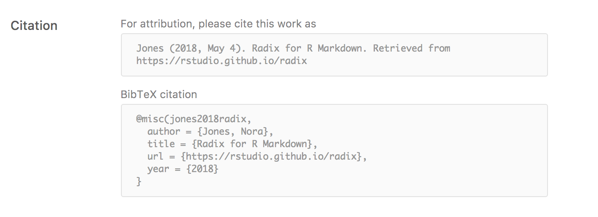
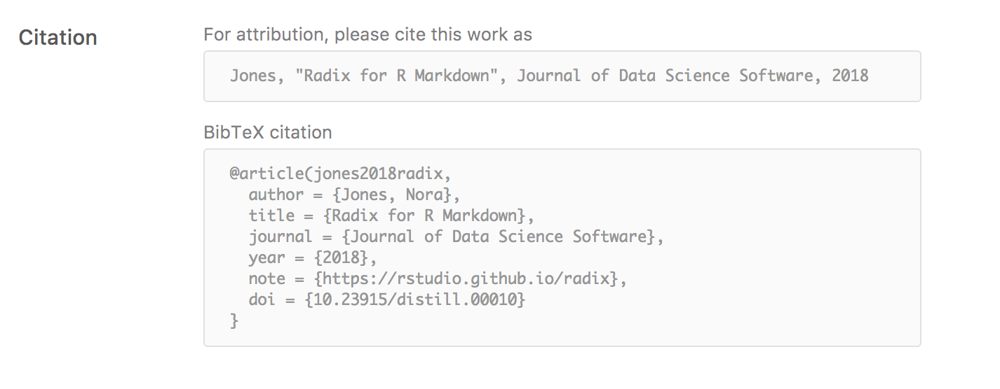

```{r setup, include=FALSE}
library(knitr)
```

Distill articles support including citations and a corresponding bibliography using standard R Markdown citation syntax. Distill also provides tools for making your articles more [easily citeable](#creating-citeable-articles), as well as for generating [Google Scholar] compatible citation metadata.

## Citing other works

Use standard [R Markdown bibliographies](https://rmarkdown.rstudio.com/authoring_bibliographies_and_citations.html) for citing other works. To do this, first create a bibliography file using a supported format (e.g. BibTeX or CSL) and refer to it from the `bibliography` field of the YAML front-matter. For example:

``` {.yaml}
---
title: "Distill for R Markdown"
description: | 
  Scientific and technical writing, native to the web
output: distill::distill_article
date: May 4, 2018
author:
  - name: Nora Jones 
    url: https://example.com/norajones
    affiliation: Spacely Sprockets
    affiliation_url: https://example.com/spacelysprokets
bibliography: biblio.bib
---
```

Here's an example of what one of the entries in your BibTeX file might look like:

``` {.bibtex}
@Book{xie2015,
  title = {Dynamic Documents with R and knitr},
  author = {Yihui Xie},
  publisher = {Chapman and Hall/CRC},
  address = {Boca Raton, Florida},
  year = {2015},
  edition = {2nd},
  note = {ISBN 978-1498716963},
  url = {http://yihui.name/knitr/},
}
```

To cite this within your article, use standard R Markdown notation, for example: `[@xie2015]` (referencing an id provided in the bibliography). Note that multiple ids (separated by semicolons) can be provided.

## Creating citeable articles {#creating-citeable-articles}

You can make it easier for others to cite your work by providing additional metadata with the YAML front-matter of your article. Citations can be provided for both articles published to the web or for articles published in journals (with or without a [DOI](https://www.doi.org/)).

### Web articles

To provide a citation for an article published to the web, include `author` and `date` metadata as well as a `citation_url`. For example:

``` {.yaml}
---
title: "Distill for R Markdown"
description: | 
  Scientific and technical writing, native to the web
date: May 4, 2018
author:
  - name: Nora Jones 
    url: https://example.com/norajones
    affiliation: Spacely Sprockets
    affiliation_url: https://example.com/spacelysprokets
citation_url: https://rstudio.github.io/distill
slug: jones2018distill
bibliography: biblio.bib
---
```

Note that the `citation_url` field is not required for [blog articles](blog.html) (in that case it's computed automatically using the site's `base_url` field).

When this metadata is available, a citation appendix is automatically added to the article which looks like this:

{.screenshot width="95%"}

Note that we also included a `slug` field (in this case `jones2018distill`) which affects the abbreviated version of the citation included in the BibTeX entry. If you don't provide a `slug` then one will be automatically generated.

### Journal articles

If your article is published within a Journal, you can add the following the additional fields to generate the appropriate citation entry:

| Metadata  | Description                                             |
|-----------|---------------------------------------------------------|
| `journal` | Name of Journal published within                        |
| `doi`     | Digital Object Identifier ([DOI](https://www.doi.org/)) |

Here's our previous examples amended with these fields:

``` {.yaml}
---
title: "Distill for R Markdown"
description: | 
  Scientific and technical writing, native to the web
date: May 4, 2018
author:
  - name: Nora Jones 
    url: https://example.com/norajones
    affiliation: Spacely Sprockets
    affiliation_url: https://example.com/spacelysprokets
journal: "Journal of Data Science Software"
doi: "10.23915/distill.00010"
slug: jones2018distill
citation_url: https://rstudio.github.io/distill
bibliography: biblio.bib
---
```

This is how the citation is presented in the appendix:

{.screenshot width="95%"}

For Journal articles, the `citation_url` is included in the BibTeX entry within the `note` field.

```{r, child="_common/google_scholar.Rmd"}
```
