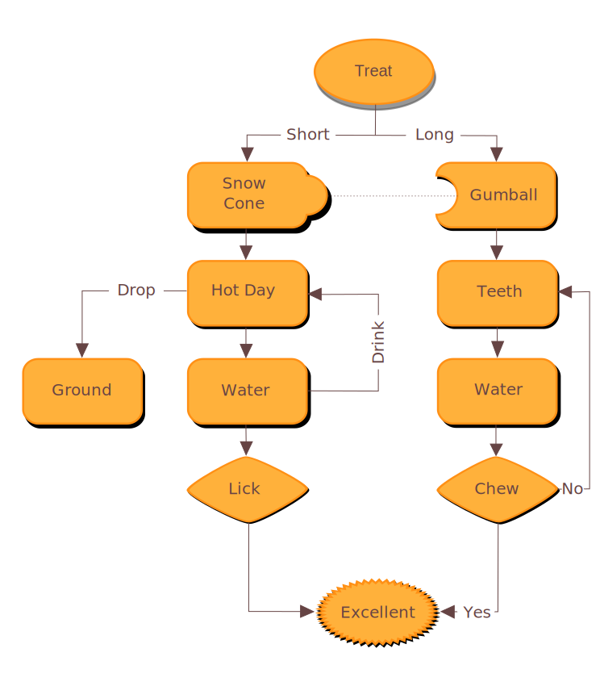

There are a number of ways to create diagrams for use in Distill articles, a few worth considering are:

-   The [DiagrammerR](http://rich-iannone.github.io/DiagrammeR/) package, which enables you to generate graph diagrams using text (both [GraphViz](https://www.graphviz.org/) and [Mermaid](https://mermaidjs.github.io/) are supported).

-   The [r2d3](https://rstudio.github.io/r2d3) package, which enables you to create fully custom diagrams with [D3.js](https://d3js.org/).

-   For more highly customized static diagrams you can use a variety of vector graphics tools (e.g. [Inkscape](https://inkscape.org/en/)) to create SVG files that can be included within your article.

## DiagrammeR

You can use the [DiagrammerR](http://rich-iannone.github.io/DiagrammeR/) package to include [GraphViz](https://www.graphviz.org/) visualizations within a Distill article. For example, if you have a GraphViz file [graph.gv](https://github.com/rstudio/distill/blob/main/docs/images/graph.gv), you can include it with the following code:

```` {.clike}
```{r, layout="l-page", fig.height=2}`r ''`
library(DiagrammeR)
grViz("images/graph.gv")
```
````

```{r, layout="l-page", fig.height=2}
library(DiagrammeR)
grViz("images/graph.gv")
```

Note that since this diagram is much wider than it is tall, we specify `layout="l-page"` to provide adequate horizontal layout space and `fig.height=2` to ensure the correct aspect ratio. See the documentation on [figure layout](figures.html) for details on all available layout options.

DiagrammeR also supports diagrams created with [Mermaid](https://mermaidjs.github.io/). For example:

```` {.clike}
```{r}`r ''`
library(DiagrammeR)
mermaid(diagram = '
sequenceDiagram
  participant Alice
  participant Bob
  Alice->>John: Hello John, how are you?
  loop Healthcheck
      John->>John: Fight against hypochondria
  end
  Note right of John: Rational thoughts<br/>prevail...
  John-->>Alice: Great!
  John->>Bob: How about you?
  Bob-->>John: Jolly good!
')
```
````

```{r}
library(DiagrammeR)
mermaid(diagram = '
sequenceDiagram
  participant Alice
  participant Bob
  Alice->>John: Hello John, how are you?
  loop Healthcheck
      John->>John: Fight against hypochondria
  end
  Note right of John: Rational thoughts<br/>prevail...
  John-->>Alice: Great!
  John->>Bob: How about you?
  Bob-->>John: Jolly good!
')
```

## D3 diagrams

The [r2d3](https://rstudio.github.io/r2d3) package enables you to include illustrations created using [D3.js](https://d3js.org/). For example, the following code renders [flare.json](https://github.com/rstudio/distill/blob/main/docs/d3/circlepacking/flare.json) using the [circlepacking.js](https://github.com/rstudio/distill/blob/main/docs/d3/circlepacking/circlepacking.js) script:

```` {.clike}
```{r, layout="l-screen-inset", fig.height=8}`r ''`
library(r2d3)
data <- jsonlite::read_json("flare.json")
r2d3(data, script = "circlepacking.js")
```
````

```{r, layout="l-screen-inset", fig.height=8}
library(r2d3)
data <- jsonlite::read_json("d3/circlepacking/flare.json")
r2d3(data, script = "d3/circlepacking/circlepacking.js")
```

This is an illustration that has lots of detail so it benefits from being rendered at nearly full screen width (`layout="l-screen-inset"`). We also specify `fig.height=8` to cause the illustration (which has a square aspect ratio) to take advantage of the additional horizontal space.

## Static diagrams

For more highly customized static diagrams you can use a vector graphics tools like [Inkscape](https://inkscape.org/en/), [Adobe Illustrator](https://www.adobe.com/products/illustrator.html), or [Sketch](https://www.sketchapp.com/).

These programs are all capable of exporting [SVG (Scalable Vector Graphics)](https://en.wikipedia.org/wiki/Scalable_Vector_Graphics). Once you've exported an SVG you can include it in your article using the `knitr::include_graphics()` function. For example, to include the SVG file created within this [Inkscape tutorial](http://www.ioncannon.net/utilities/123/10-tips-for-creating-good-looking-diagrams-using-inkscape/) you would use the following code:

```` {.clike}
```{r}`r ''`
library(knitr)

```
````

```{r, fig.height=5}
library(knitr)

```

This particular illustration uses the default layout (occupying the full width of the article text). Note though that you can use the various [figure layout](figures.html) options to control the size and placement of SVG files included from illustration programs.
