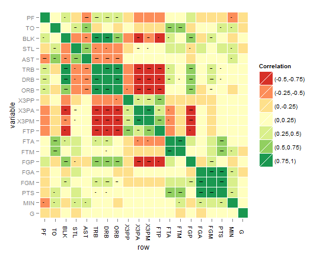
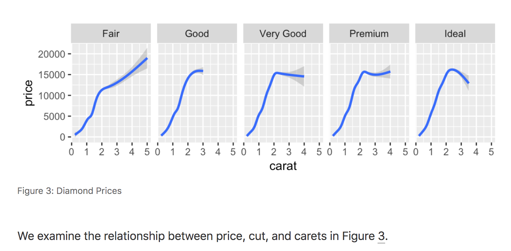

```{r setup, include=FALSE}
library(knitr)
```

## Default layout

There are a variety of ways to layout figures included within Distill articles. This layout is controlled by a set of layout classes, which are in turn applied to R Markdown chunks using the `layout` chunk option.

The default layout if `layout` is not specified is `l-body`, which will cause content to span the width of the main article body:

::: {.fake-img .l-body}
<p>

l-body

</p>
:::

For example, a plot with the default `l-body` layout would look like this:

```{r, layout="l-body"}
include_graphics("images/l-body-figure.png")
```

## Wider layouts

For elements you want to display a little larger, try `l-body-outset` or `l-page`:

::: {.fake-img .l-body-outset}
<p>

l-body-outset

</p>
:::

::: {.fake-img .l-page}
<p>

l-page

</p>
:::

For example, here the `l-body-outset` layout is selected using the `layout` chunk option:

```` {.clike}
```{r, layout="l-body-outset", fig.width=6, fig.height=1.5}`r ''`
library(ggplot2)
ggplot(diamonds, aes(carat, price)) + geom_smooth() +
  facet_grid(~ cut)
```
````

```{r, layout="l-body-outset"}
include_graphics("images/l-middle-figure.png")
```

Note that when specifying an alternate `layout` you should also specify an appropriate `fig.width` and `fig.height` for that layout.

## Full screen layout

Occasionally you'll want to use the full browser width. For this, use `l-screen`:

::: {.fake-img .l-screen}
<p>

l-screen

</p>
:::

If you want a bit space at the edges then you can use the `l-screen-inset` layout, which adds 15 pixels of padding to each side. Here we use `l-screen-inset` to display a Leaflet map:

```` {.clike}
```{r, layout="l-screen-inset"}`r ''`
library(leaflet)
leaflet() %>%
  addTiles() %>%  # Add default OpenStreetMap map tiles
  addMarkers(lng=174.768, lat=-36.852, popup="The birthplace of R")
```
````

```{r, layout="l-screen-inset"}
library(leaflet)
leaflet() %>%
  addTiles() %>%  # Add default OpenStreetMap map tiles
  addMarkers(lng=174.768, lat=-36.852, popup="The birthplace of R")
```

Depending on the content displayed by `l-screen-inset`, sometimes it's nice to add some shading to further deliniate the display. You can do this by adding `shaded` to the layout declaration:

```` {.clike}
```{r, layout="l-screen-inset shaded"}`r ''`
library(leaflet)
leaflet() %>%
  addTiles() %>%  # Add default OpenStreetMap map tiles
  addMarkers(lng=174.768, lat=-36.852, popup="The birthplace of R")
```
````

```{r, layout="l-screen-inset shaded"}
library(leaflet)
leaflet() %>%
  addTiles() %>%  # Add default OpenStreetMap map tiles
  addMarkers(lng=174.768, lat=-36.852, popup="The birthplace of R")
```

## Static figures

To include static figures (i.e. figures based on an existing PNG or JPEG file rather than a dynamically generated R plot), you can use the `knitr::include_graphics()` function:

```` {.clike}
```{r}`r ''`
knitr::include_graphics("images/figure.png")
```
````

You can apply Distill layouts to static figures the same way that you do plots:

```` {.clike}
```{r layout="l-body-outset"}`r ''`
knitr::include_graphics("images/figure.png")
```
````

If you are including a figure from an external source, it's good practice to delineate this by applying the `external` class and adding a caption indicating where it is from. For example:

```` {.clike}
```{r fig.cap="Figure from https://example.com", out.extra="class=external"}`r ''`

```
````

Using the `external` class and providing a "Figure from" link makes it clear that the figure originated elsewhere (and is therefore not covered by any of your article's copyright or creative commons license grants). For example, here's how a figure taken from a Stack Overflow post might appear:

{.external width="100%"}

## Cross-references

When you assign a figure caption to a code chunk via the chunk option `fig.cap`, R plots will be put into figure environments, which will be automatically labeled and numbered, and can also be cross-referenced.

For example, here we add a `fig.cap` to one of our previous examples:

```` {.clike}
```{r diamonds, fig.cap="Diamond Prices"}`r ''`
library(ggplot2)
ggplot(diamonds, aes(carat, price)) + geom_smooth() +
  facet_grid(~ cut)
```
````

The label of the figure environment is generated from the label of the code chunk, e.g., if the chunk label is `diamonds`, the figure label will be `fig:diamonds` (the prefix `fig:` is added before `diamonds`.

To reference a figure, use the syntax `\@ref(label)`, where label is the figure label. So for the example above we'd use `\@ref(fig:diamonds)`, which would result in a cross-reference like this:

```{r out.extra="class=screenshot"}

```

For additional documentation on figure cross-references see the [bookdown documentation on figures](https://bookdown.org/yihui/bookdown/figures.html) (Distill for R Markdown uses the bookdown implementation of cross-references under the hood).

One important constraint to keep in mind is that if you want to cross-reference figures or tables generated from a code chunk, please make sure the chunk label *only contains* alphanumeric characters (a-z, A-Z, 0-9), slashes (/), or dashes (-).
