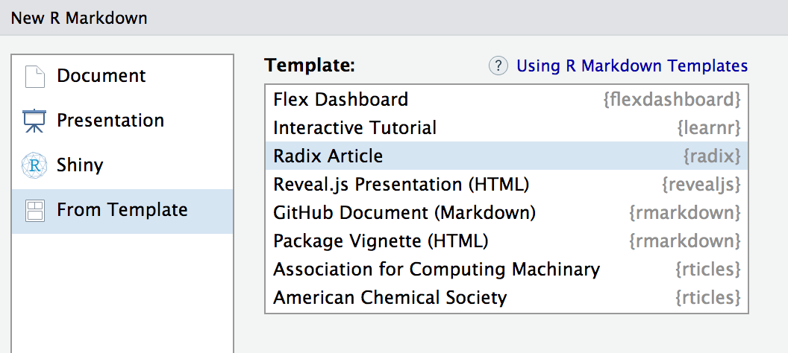

<!---


- larger scale visualization layouts
    - iframe with npr library (pym.js) for sizing (generic) (check with shinyapps.io)
    - ggplot2 theme for distill
    - distillVisualization() top level shinyApp equivalent with distill bootstrap theme 
       - use the less compiler for this
    "full bleed"
    - crosstalk compatibility?
        - distillRow/distillCol
        
- alternative to DOI is citation (which just needs a URL) or source

- Google Scholar data will require us to have programmatic access to all citations
  use pandoc-citeproc to convert bibliogrpahy to json?
  https://github.com/jgm/pandoc-citeproc/blob/master/man/pandoc-citeproc.1.md

- get interactive Rmd working with v2  
        
- may need separate metadata section in the docs
- web page metadata generation/redaction (see expandData)
- article metadata (DOI, citation, etc.)
- https://github.com/distillpub/template/blob/master/src/transforms/meta.js

- work out TZ display issues with date
- use pandoc filters more?

- index pages (consider using iframes for federated content authoring)
- site generation

--->

```{r setup, include=FALSE}
library(ggplot2)
library(knitr)
```

Radix is an online publication format designed for scientific and technical communication. Radix articles include:

- Reader-friendly typography that adapts well to mobile devices.
- Features essential to technical writing like [LaTeX math](#equations), [citations], and [footnotes].
- Flexible [figure layout](figures.html) options (e.g. displaying figures at a larger width than the article text).
- Attractively rendered [tables](tables.html) with optional support for pagination.
- Support for a wide variety of [diagramming tools](diagrams.html) for illustrating concepts.
- A variety of ways to enhance articles with [interactive visualizations](interactivity.html).

Radix is based on the [Distill web framework](https://github.com/distillpub/template), which was originally created for use in the Distill Machine Learning Journal [@distill]. Radix combines the technical authoring features of Distill with [R Markdown](https://rmarkdown.rstudio.com/), enabling a fully reproducible workflow based on literate programming [@knuth1984].

## Getting Started

To create an [R Markdown](https://rmarkdown.rstudio.com) document that uses the Radix format, first install the **radix** R package:

```r
devtools::install_github("jjallaire/radix")
```

Then, use the **New R Markdown** dialog within RStudio to create a new Radix article:

{width="100%" .screenshot}

You can also create a new Radix article from the command line with:

```r
library(rmarkdown)
draft("article.Rmd", "radix_article", package = "radix")
```

<div id="front-matter"></div>

Radix articles use `radix::radix_article` as their output format, and typically include title, description, date, author/affiliation, and bibliography entries in their YAML front-matter:

```markup
---
title: "Radix for R Markdown"
description: | 
  Scientific and technical writing, native to the web
date: May 4, 2018
author:
  - name: "JJ Allaire"
    url: https://github.com/jjallaire
    affiliation: RStudio
    affiliation_url: https://www.rstudio.com
  - name: "Rich Iannone"
    url: https://github.com/rich-iannone
    affiliation: RStudio
    affiliation_url: https://www.rstudio.com
  - name: "Yihui Xie"
    url: https://github.com/yihui
    affiliation: RStudio
    affiliation_url: https://www.rstudio.com
bibliography: biblio.bib
output: radix::radix_article
---
```

Author entires must have at least `name` and `url` specified (the affiliation fields are optional). The `date` field should be formatted as month, day, year (various notations are supported as long as the compontents appear in that order).

The article's description and author bylines are automatically rendered as part of the title area of the document.

The `bibliography` field is used to provide a reference to the Bibtex file where all of the sources cited in your article are defined. The [citations] section describes how to include references to these sources in your article.

## Figures

Radix provides a number of options for laying out figures within your article. By default figures span the width of the main article body:

{width=100%}

However, some figures benefit from using additional horizontal space. In this cases the `layout` chunk option enables you to specify a wide variety of other layouts. 

For example, if we wanted to display a figure a bit outside the bounds of the article text, we could specify the `l-body-outset` layout via the `layout` chunk option:


````clike
```{r, layout="l-body-outset", fig.width=6, fig.height=1.5}`r ''`
library(ggplot2)
ggplot(diamonds, aes(carat, price)) + geom_smooth() +
  facet_grid(~ cut)
```
````

```{r, layout="l-body-outset"}
include_graphics("images/l-middle-figure.png")
```

Note that when specifying an alternate `layout` you should also specify an appropriate `fig.width` and `fig.height` for that layout. These values don't determine the absolute size of the figure (that's dynamic based on the layout) but they do determine the aspect ratio of the figure.

See the documentation on [figure layout](figures.html) for details on additional layout options.

## Tables

There are a number of options available for HTML display of data frames within Radix articles. Here, we use the `paged_table()` function to display a page-able view of the `mtcars` dataset built in to R:

````clike
```{r, layout="l-body-outset"}`r ''`
library(rmarkdown)
paged_table(mtcars)
```
````

```{r, layout="l-body-outset"}
library(rmarkdown)
paged_table(mtcars)
```

Note that we used `layout="l-body-outset"` to cause the table to occupy slightly more horizontal space than the article text. All of available [figure layout options](figures.html) work as expected for tables.

See the documentation on [table display](tables.html) for details on the various techniques available for rendering tables.

## Equations

Inline and display equations are supported via standard markdown [MathJax](https://www.mathjax.org/) syntax. For example, the following [LaTeX math](https://en.wikibooks.org/wiki/LaTeX/Mathematics):


    $$
    \sigma = \sqrt{ \frac{1}{N} \sum_{i=1}^N (x_i -\mu)^2}
    $$
  
Will be rendered as:

$$
\sigma = \sqrt{ \frac{1}{N} \sum_{i=1}^N (x_i -\mu)^2}
$$


## Citations

Bibtex is the supported way of making academic citations. To include citations, first create a bibtex file and refer to it from the `bibliography` field of the YAML front-matter (as [illustrated above](#front-matter)).

For example, your bibliography file might contain:

```markup
@Book{xie2015,
  title = {Dynamic Documents with R and knitr},
  author = {Yihui Xie},
  publisher = {Chapman and Hall/CRC},
  address = {Boca Raton, Florida},
  year = {2015},
  edition = {2nd},
  note = {ISBN 978-1498716963},
  url = {http://yihui.name/knitr/},
}
```

You are strongly encouraged you to populate the `url` bibtex field where possible so that links can be provided for citations.

Citations are then used in the article body with standard Pandoc markdown notation, for example: `[@xie2015]` (which references an id provided in the bibliography). Note that multiple ids (separated by semicolons) can be provided.

The citation is presented inline like this: [@xie2015] (a number that displays more information on hover). If you have an appendix, a bibliography is automatically created and populated in it.

Radix chose a numerical inline citation style to improve readability of citation dense articles and because many of the benefits of longer citations are obviated by displaying more information on hover. However, we consider it good style to mention author last names if you discuss something at length and it fits into the flow well---the authors are human and it’s nice for them to have the community associate them with their work.

## Footnotes

Footnotes use standard Pandoc markdown notation, for example `^[This will become a hover-able footnote]`. The number of the footnote will be automatically generated. ^[This will become a hover-able footnote]

You can also optionally include note in the gutter of the article (immediately to the right of the article text). To do this use the `<aside>` tag.

<aside>
This content will appear in the gutter of the article.
</aside>

```html
<aside>
This content will appear in the gutter of the article.
</aside>
```

## Code Blocks

Syntax highlighting is provided for knitr code chunks. Note that by default the Radix format does not display the code for chunks that are evaluated to produce output (knitr option `echo = FALSE`). 

To display the code that was evaluated to produce output you can set the `echo` chunk option to `TRUE`:

````clike
```{r, echo=TRUE}`r ''`
1 + 1
```
````

To include code that is only displayed and not evaluated specify the `eval=FALSE` option:

````clike
```{r, eval=FALSE, echo=TRUE}`r ''`
1 + 1
```
````

## Appendices

Appendices can be added after your article by adding the `.appendix` class to any level 1 or level 2 header. For example:

```html
## Acknowledgments {.appendix}

This is a place to recognize people and institutions. It may also be a good place
to acknowledge and cite software that makes your work possible.

## Author Contributions {.appendix}

We strongly encourage you to include an author contributions statement briefly 
describing what each author did.
```

Footnotes and references will be included in the same section, immediately beneath any custom appendices.

## Acknowledgments {.appendix}

Radix builds on the work of many individuals and projects. [Shan Carter](https://github.com/shancarter), [Ludwig Schubert](https://github.com/ludwigschubert), and [Christopher Olah](https://github.com/colah) created the Distill web framework. [John MacFarlane](https://github.com/jgm) created the Pandoc universal markup converter. [Davide Cervone](https://github.com/dpvc) and [Volker Sorge](https://github.com/zorkow) created the MathJax library for rendering mathmatical notation on the web. [Mike Bostock](https://github.com/mbostock) created the D3 library for producing dynamic, interactive data visualizations for the web. We are grateful for the spirit of generousity that moved these individuals to create high-quality open source software for the benefit of all.


