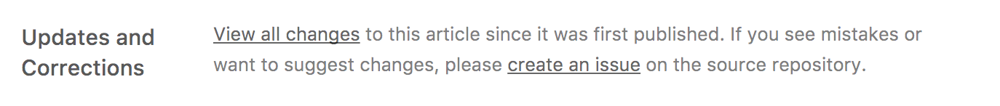
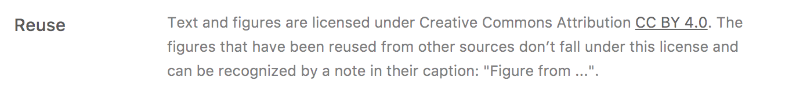
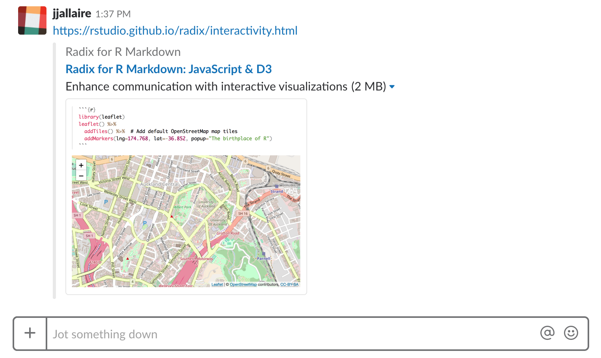

```{r setup, include=FALSE}
library(knitr)
```

You can enhance Distill articles by providing various types of metadata, including:

1)  Links to the article's source code repository.

2)  [Creative Commons] licensing terms.

3)  [Open Graph] and [Twitter Card] metadata that is automatically included when the article is shared (e.g. on Twitter or within Slack).

4)  [Google Scholar] compatible citation metadata for your article as well as other works cited by your article.

## Code repository

You can include the `repository_url` field to indicate where the source code for your article can be found. For example:

``` yaml
---
title: "Distill for R Markdown"
description: | 
  Scientific and technical writing, native to the web
output: distill::distill_article
repository_url: https://github.com/rstudio/distill
---
```

You can optionally also include a `compare_updates_url` to provide a URL that will show the differences between the article's current version and the version that was initially published. For example:

``` yaml
---
title: "Distill for R Markdown"
description: | 
  Scientific and technical writing, native to the web
output: distill::distill_article
repository_url: https://github.com/rstudio/distill
compare_updates_url: https://github.com/rstudio/distill/compare/pubv1...main
---
```

If you include one or both of these fields, then an *Updates and Corrections* appendix is automatically generated. For example:

{.screenshot width="95%"}

## Creative Commons

The [Creative Commons](https://creativecommons.org/licenses/) copyright licenses and tools forge a balance inside the traditional "all rights reserved" setting that copyright law creates. These tools give everyone from individual creators to large companies and institutions a simple, standardized way to grant copyright permissions to their creative work.

Here are some of the common forms of Creative Commons content license:

| License                                                           | Name                                          | Description                                                                                                                                                                                                                                                                                                                                                                                                                                                  |
|-------------------------------------------------------------------|-----------------------------------------------|--------------------------------------------------------------------------------------------------------------------------------------------------------------------------------------------------------------------------------------------------------------------------------------------------------------------------------------------------------------------------------------------------------------------------------------------------------------|
| [CC BY](https://creativecommons.org/licenses/by/4.0/)             | Attribution                                   | This license lets others distribute, remix, tweak, and build upon your work, even commercially, as long as they credit you for the original creation. This is the most accommodating of licenses offered.                                                                                                                                                                                                                                                    |
| [CC BY-SA](https://creativecommons.org/licenses/by-sa/4.0/)       | Attribution-ShareAlike                        | This license lets others remix, tweak, and build upon your work even for commercial purposes, as long as they credit you and license their new creations under the identical terms. This license is often compared to "copyleft" free and open source software licenses. All new works based on yours will carry the same license, so any derivatives will also allow commercial use.                                                                        |
| [CC BY-ND](https://creativecommons.org/licenses/by-nd/4.0/)       | Attribution-NoDerivs                          | This license allows for redistribution, commercial and non-commercial, as long as it is passed along unchanged and in whole, with credit to you.                                                                                                                                                                                                                                                                                                             |
| [CC BY-NC](https://creativecommons.org/licenses/by-nc/4.0/)       | Attribution-NonCommercial                     | This license lets others remix, tweak, and build upon your work non-commercially, and although their new works must also acknowledge you and be non-commercial, they don't have to license their derivative works on the same terms.                                                                                                                                                                                                                         |
| [CC BY-NC-SA](https://creativecommons.org/licenses/by-nc-nd/4.0/) | Attribution-NonCommercial-ShareAlike          | This license lets others remix, adapt, and build upon your work non-commercially, as long as they credit you and license their new creations under the identical terms.                                                                                                                                                                                                                                                                                      |
| [CC BY-NC-ND](https://creativecommons.org/licenses/by-nc-nd/4.0)  | Attribution-NonCommercial-NoDerivs            | This license is the most restrictive of our six main licenses, only allowing others to download your works and share them with others as long as they credit you, but they can't change them in any way or use them commercially.                                                                                                                                                                                                                            |
| [CC0](https://creativecommons.org/publicdomain/zero/1.0/)         | Public Domain Dedication - No Rights Reserved | CC0 enables scientists, educators, artists and other creators and owners of copyright- or database-protected content to waive those interests in their works and thereby place them as completely as possible in the public domain, so that others may freely build upon, enhance and reuse the works for any purposes without restriction under copyright or database law. (See [About CC0](https://creativecommons.org/share-your-work/public-domain/cc0)) |

You can designate articles that you create as Creative Commons licensed by adding the `creative_commons` field and specifying one of the standard Creative Commons licenses. For example:

``` yaml
---
title: "Distill for R Markdown"
description: | 
  Scientific and technical writing, native to the web
output: distill::distill_article
creative_commons: CC BY
---
```

If you include this field then a *Reuse* appendix is automatically generated. For example:

{.screenshot width="95%"}

### External figures

Note that figures from external sources are explicitly carved out of the license. If you are including a figure from an external source, it's good practice to delineate this by applying the `.external` class and adding a caption indicating where it is from. For example:

``` markup
{width=100% .external}    
```

Using the `.external` class and providing a "Figure from" link makes it clear that the figure originated elsewhere (and is therefore not covered by any of your article's copyright or creative commons license grants). For example, here's how a figure taken from a Stack Overflow post might appear:

{.external width="100%"}

## Preview images {#preview-images}

You can specify a preview image for your article (for sharing on Slack, Twitter, etc.) in a number of different ways:

1.  You can explicitly provide the full URL of the preview image via the `preview` field in the article's metadata. For example:

    ``` yaml
    ---
    title: "JavaScript & D3"
    description: Enhance communication with interactive visualizations 
    preview: https://rstudio.github.io/distill/images/javascript-d3-preview.png
    ---
    ```

    Note that the preview image is specified with a full absolute URL. This is a requirement of both Open Graph and Twitter (relative image references are not supported). If you are publishing a standalone self-contained HTML version of your article then you'll need to upload the preview image to another location on the web in order to reference it.

2.  If your article is not self-contained (it's part of a [Distill website](publish_website.html) or is generated with `self_contained: false`) then you can include the preview image alongside your document. In this case you still need to specify the root URL where your image will be published to using the `base_url` field:

    ``` yaml
    ---
    title: "JavaScript & D3"
    description: Enhance communication with interactive visualizations 
    base_url: https://rstudio.github.io/distill
    preview: images/javascript-d3-preview.png
    ---
    ```

    This technique is generally preferable to including the full URL since it allows Distill to inspect the image file directly and provide additional information about it's size.

3.  You can also specify that a specific figure within your article should be used as the preview image. To do this, just add the `preview = TRUE` chunk option to the chunk which creates the figure. For example:

    ``` yaml
    ---
    title: "JavaScript & D3"
    description: Enhance communication with interactive visualizations 
    base_url: https://rstudio.github.io/distill
    ---
    ```

    ```` clike
    ```{r, layout="l-body-outset", preview=TRUE}`r ''`
    library(ggplot2)
    ggplot(diamonds, aes(carat, price)) + geom_smooth() +
      facet_grid(~ cut)
    ```
    ````

    As with using the `preview` metadata field, this method requires that your Distill article is not a single standalone HTML file (`self_contained: false`) and also requires that you specify a `base_url` field indicating the domain and path where the article will be published.

## Open Graph

The [Open Graph protocol](http://ogp.me/) is a specification that enables richer sharing of links to articles on the web. Open Graph metadata is automatically generated for Distill articles. For example, here's what you see in Slack when pasting in a link to the article on using [JavaScript and D3](interactivity.html) within Distill articles:

{.screenshot width="95%"}

Slack uses Open Graph to extract and display the title, description, and a [preview image](#preview-images) (if specified) for the link.

## Twitter Card

[Twitter Cards](https://developer.twitter.com/en/docs/tweets/optimize-with-cards/overview/abouts-cards) are a way of enhancing the appearance of links to your article on Twitter. When a link to your article is included in a Tweet, Twitter automatically crawls your site to fetch any available Twitter Card metadata.

See the section on [preview images](#preview-images) for additional details on providing an image for your article that will be included on Twitter Cards.

There are two additional fields you can include that provide attribution for your link to the Twitter account of a website and/or creator of the article. This attribution is specified via the `twitter:site` and `twitter:creator` fields.

Here's a complete example that includes the attribution fields as well as a preview image:

``` yaml
---
title: "JavaScript & D3"
description: Enhance communication with interactive visualizations 
base_url: https://rstudio.github.io/distill
preview: images/javascript-d3-preview.png
twitter:
  site: "@rstudio"
  creator: "@fly_upside_down"
---
```

Be sure to enclose the Twitter account names in quotes (this is required because they start with `@`).

```{r, child="_common/google_scholar.Rmd"}
```
