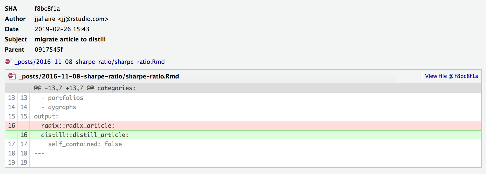
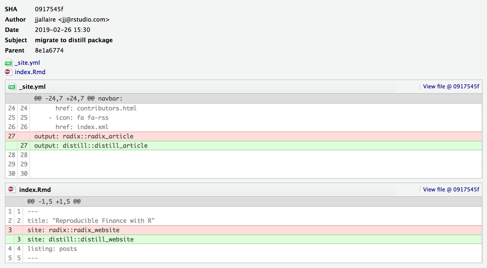

When the **distill** package was initially published on CRAN, it was named **radix**. The name of the package has been subsequently changed to reflect it's relationship with the [Distill web framework](https://github.com/distillpub/template).

You can migrate your Radix documents to Distill by simply changing the output format from `radix::radix_article` to `distill::distill_article`. For example:

{.screenshot width="95%"}

If you have created a blog or website with Radix, you should additionally modify the `_site.yml` and `index.Rmd` files to reflect the use of the Distill package:

{.screenshot width="95%"}
