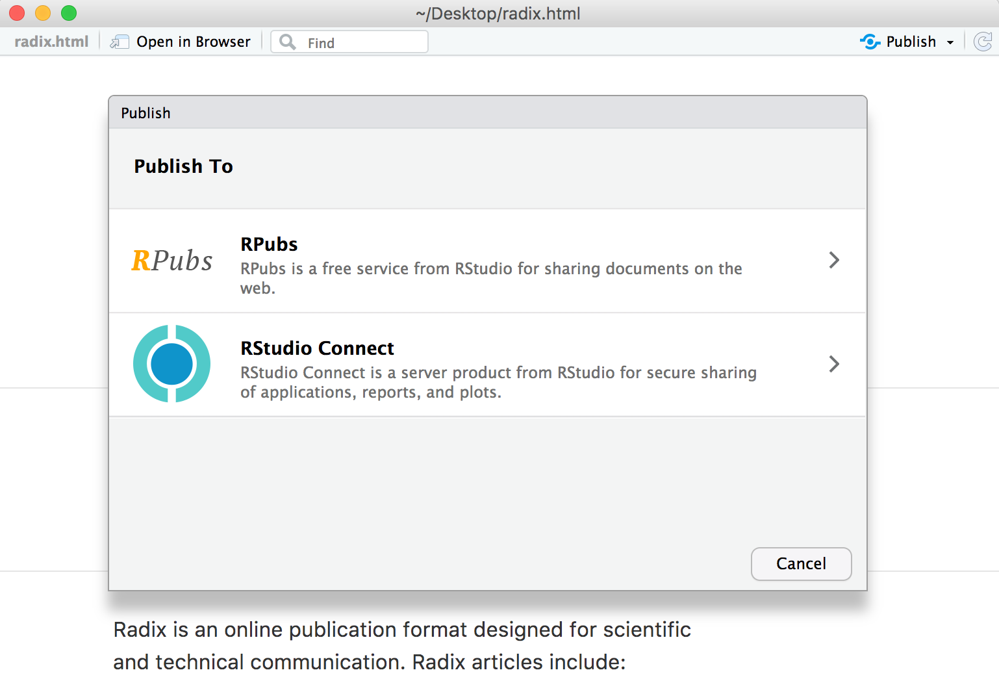
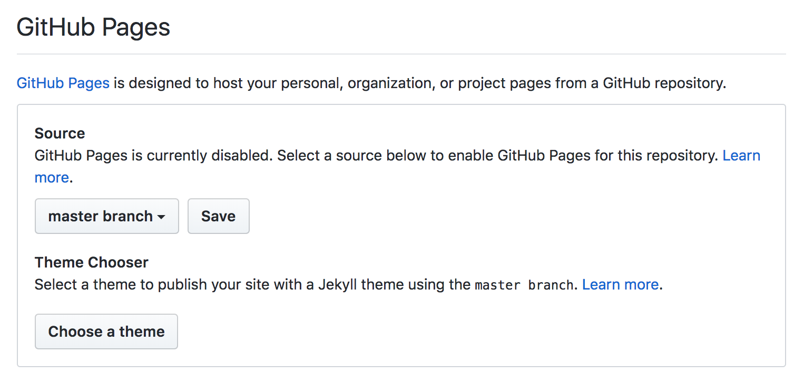

```{r setup, include=FALSE}
library(knitr)
```

This article covers the various ways you can publish Distill articles, including:

-   Sharing a standalone HTML file using E-mail, Dropbox, etc.

-   Publishing to [RPubs](#rpubs-and-rstudio-connect) or [RStudio Connect](#rpubs-and-rstudio-connect).

-   Using [GitHub Pages] to host your article on GitHub

Note that it's also possible to publish collections of Distill articles as a website (see the article on [publishing websites](publish_website.html) for additional details).

## Standalone HTML

When you render a Distill article using R Markdown, all of the content required to render the article (images generated by R plots, required CSS and JavaScript, etc.) are bundled into a single HTML file.

Often the simplest way to share a Distiill article is to share this HTML file using the same means you use to share other document types like spreadsheets, presentations, and PDFs. You can send the article as an E-mail attachment or uploading it to Dropbox or any other file sharing service.

This type of sharing is suitable for private communications to small groups. If you want to make your article available more broadly the following sections cover various ways to do that.

## RPubs & RStudio Connect

[RPubs](https://rpubs.com) is a free service from RStudio for sharing documents on the web. [Posit Connect](https://posit.co/products/enterprise/connect/) is a server product from RStudio for secure sharing of applications, reports, and plots.

You can publish to RPubs or RStudio Connect directly from within the R Markdown document preview window by clicking the **Publish** button:

{.screenshot width="95%"}

Note that all documents published to RPubs are publicly visible, so you should only publish content you want to share publicly.

Unlike RPubs, RStudio Connect is a server that you run inside an organization, so is suitable for publishing content that you only want visible within your organization's network.

## GitHub Pages

[GitHub Pages](https://pages.github.com/) is a service that lets you publish a website from any GitHub repository. While the service supports publishing full websites, it's also a perfectly suitable place to publish a single Distill article.

Here are the steps required to publish a Distill article to GitHub Pages:

1)  Create a new Git repository that will be used to host your article.

2)  Configure your repository to publish the contents of the `master` or `main` branch (you can do from the *Settings* page for the repository):

    {.screenshot width="90%"}

3)  Create a file named `.nojekyll` in your repository (this is required to disable some processing of HTML files that GitHub does by default). You can do this with the following code:

    ```{r, eval=FALSE, echo=TRUE}
    file.create(".nojekyll")
    ```

4)  Create a Distill article named `index.Rmd` within the repository (using this name will allow your article to be served as the default web page for the repository).

5)  Add appropriate metadata to the article. The article should at a minimum include `title` and `description` fields, and should also specify `self_contained: false` (this will make the article load faster and will enable you to add a [preview image](metadata.html#preview-images) for sharing the article on Slack, Twitter, etc.):

    ``` yaml
    ---
    title: "Distill for R Markdown"
    description: |
      Scientific and technical writing, native to the web
    output:
      distill::distill_article:
        self_contained: false
    ---
    ```

6)  Write and render your article using R Markdown.

7)  Push the article (including the HTML file generated when you rendered it) to GitHub. Your article is now published!

GitHub Pages are served on the `github.io` domain (with your GitHub account as a sub-domain). For example, if your GitHub username is `jsmith` and your repository is named `distill-article` then the article will be available at <https://jsmith.github.io/distill-article>.

## Other services

Note that any web server or web host capable of hosting a static website can equally well host a single Distill article. See the article on publishing Distill websites for details on publishing articles on a variety of other services including [Netlify](publish_website.html#netlify), [Firebase](publish_website.html#firebase), [Site44](publish_website.html#site44), and [Amazon S3](publish_website.html#amazon-s3).
