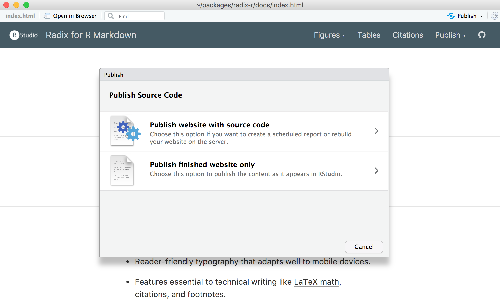
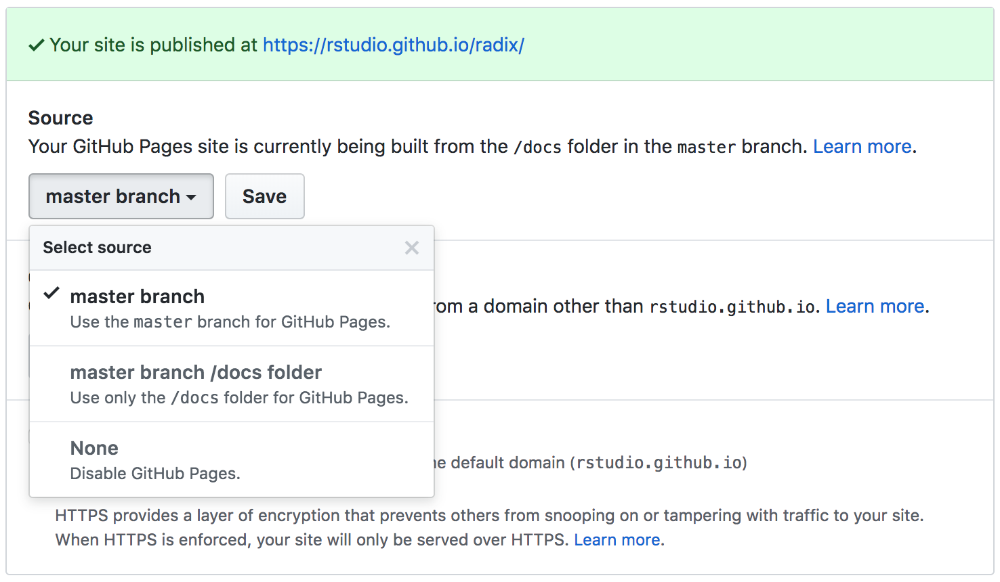
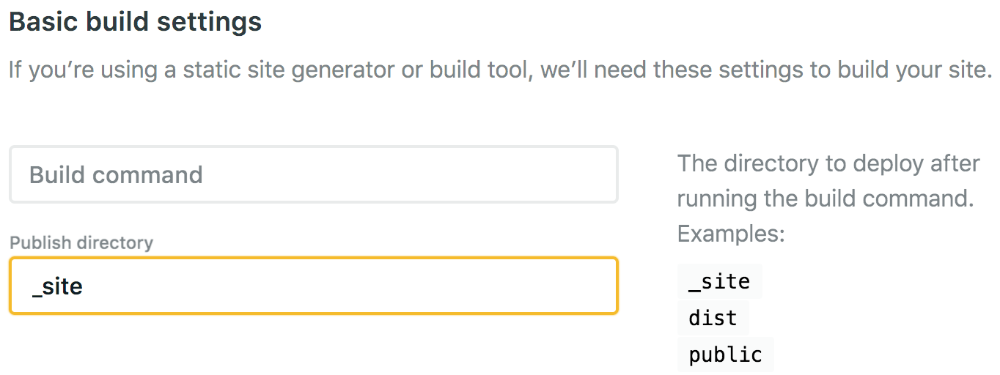

```{r setup, include=FALSE}
library(knitr)
```

There are a wide variety of ways to publish Distill websites. Website content is by default written to the `_site` sub-directory (you can customize this using the `output_dir` metadata field). Publishing is simply a matter of copying the output directory to a web server or web hosting service.

Below we describe several convenient options for Distill website deployment including [RStudio Connect], [GitHub Pages], [Netlify], [Firebase], [Site44], and [Amazon S3]. We'll mostly defer to the documentation provided by the various services, but will note any Distill website specific configuration required.

## Posit Connect

[Posit Connect](https://posit.co/products/enterprise/connect/) is a server product from RStudio for secure sharing of websites, applications, reports, and plots.

You can deploy a Distill website to RStudio Connect from the command line using the `distill::publish_website()` function. For example:

```{r, eval=FALSE, echo=TRUE}
library(distill)
publish_website(server = "https://rsc.example.com")
```

Note that once you've published your site for the first time you can omit the `server` argument:

```{r, eval=FALSE, echo=TRUE}
publish_website()
```

You can also publish a Distill website directly to an RStudio Connect server from within the website preview window by clicking the **Publish** button:

{.screenshot width="95%"}

Note that you can either publish your website with the source code (so it can be regenerated on a scheduled basis) or publish a copy of the website you built locally. Generally publishing a copy is more straightforward so that's the recommended option unless you have specialized requirements.

Unlike the other website publishing options described below, [Posit Connect](https://posit.co/products/enterprise/connect/) is a server that you run inside an organization, so is suitable for publishing content that you only want visible within your organization's network as opposed to visible to the entire internet.

## GitHub Pages

[GitHub Pages](https://pages.github.com/) is a service that lets you publish a website from any GitHub repository. There are two additional configuration steps required to host a Distill website using GitHub Pages:

1.  Create a file named `.nojekyll` in your repository (this is required to disable some processing of HTML files that GitHub does by default). You can do this with the following code:

    ```{r, eval=FALSE, echo=TRUE}
    file.create(".nojekyll")
    ```

2.  Set the `output_dir` within `_site.yml` to match the repository directory your site is served from. You can configure GitHub Pages to publish from the root of your `master` or `main` branch or the `docs` sub-directory:

    {width="95%"}

    Depending on your configuration you should set the `output_dir` as follows:

    ``` yaml
    output_dir: "."     # root of master or main branch
    output_dir: "docs"  # docs directory of master or main branch
    ```

See the [GitHub Pages](https://pages.github.com/) documentation for additional details on creating and deploying websites with GitHub.

## Netlify

[Netlify](https://www.netlify.com/) is a popular website hosting service that allows for both direct upload of website files or integrated publishing from Git repositories (GitHub, GitLab, or Bitbucket) via commit-hooks.

If you are using Netlify Git integration, be sure to set the publish directory to the output directory of your website (`_site` by default but modifiable via the `output_dir` metadata value). For example:

{.screenshot width="95%"}

## Google Firebase

Google Firebase has a [web hosting service](https://firebase.google.com/docs/hosting/quickstart) that enables easy deployment of websites using a set of command line tools.

Firebase websites by default deploy content from the `public` directory of the Firebase project directory. This means that you should set the `output_dir` to `"public"` within `_site.yml`:

``` yaml
---
name: "distill"
title: "Distill for R Markdown"
output_dir: "public"
---
```

## Site44 (Dropbox)

[Site44](https://www.site44.com/) is a service that allows you to publish websites from within Dropbox folders. Site44 creates a `Dropbox/Apps/site44` directory, and any folders within that directory are published as websites.

The recommended workflow for deploying Distill websites to Site44 is to develop your website in a separate project directory, and then, when it's ready for final publishing, copy the contents of the `_site` directory to the folder for your website.

## Amazon S3

If you are a user of Amazon Web Services you can serve your website directly from Amazon S3. Note however that this option is a bit more technically involved than GitHub Pages, Netlify, or Site 44. See the article on [Hosting a Static Website on Amazon S3](https://docs.aws.amazon.com/AmazonS3/latest/dev/WebsiteHosting.html) for additional details.

## Other services

Any web server or web host can be used to deploy a Distill website. Here's a recent [CNET roundup](https://www.cnet.com/web-hosting/) of other web hosts you could consider. You can also deploy a Distill website on any internal (intranet) web server.
