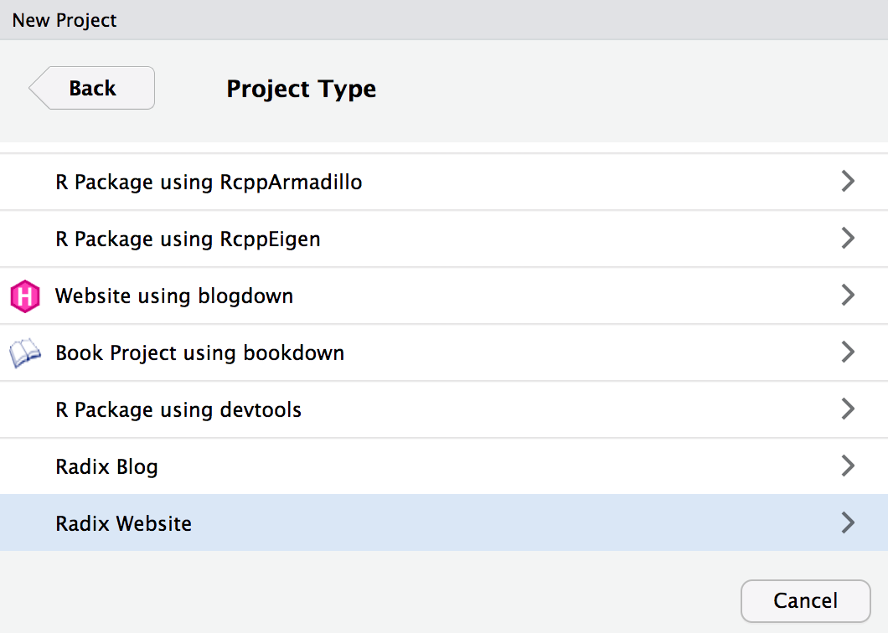
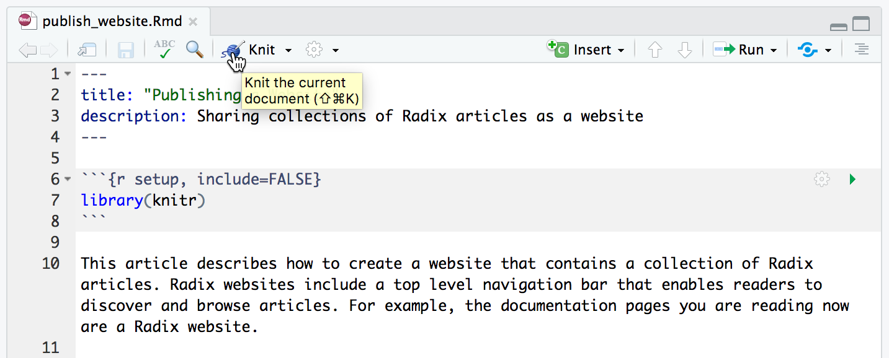
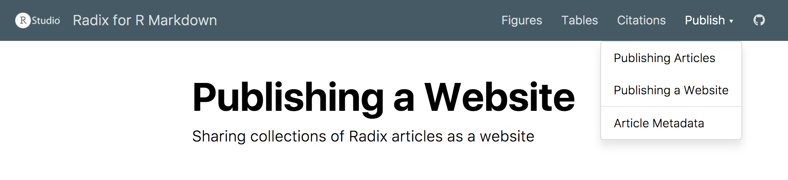
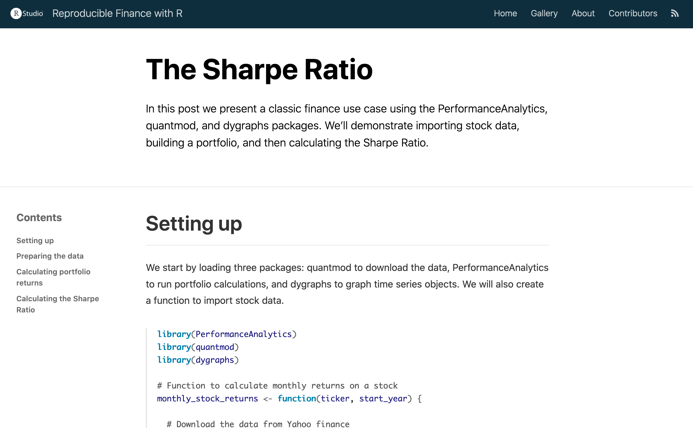
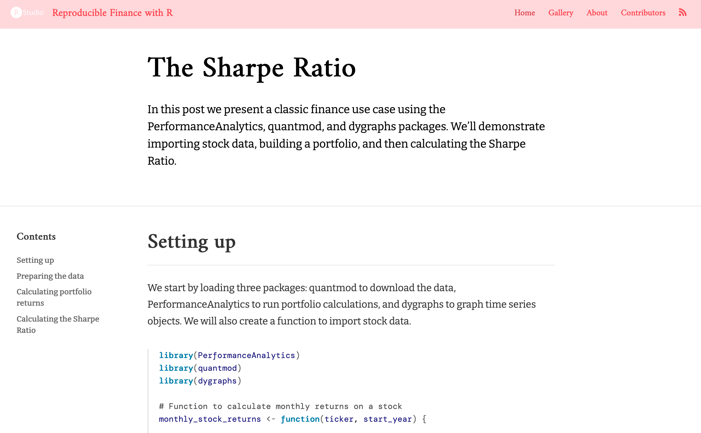

```{r setup, include=FALSE}
library(knitr)
```

This article describes how to create a website that contains a collection of Distill articles. Distill websites include a top level navigation bar that enables readers to discover and browse articles. For example, the documentation pages you are reading now are a Distill website. You can view more examples of Distill websites on the package [reference site](https://pkgs.rstudio.com/distill/articles/examples.html).

Once you've created your website locally, there are a variety of ways available to [publish your site](publish_website.html) to the web.

## Getting started

```{r, child="_common/website_vs_blog.Rmd"}
```

### Creating a website

If you are using RStudio, the easiest way to get started is to use the Distill Website option in the RStudio **New Project** dialog:

{.screenshot width="95%"}

A new [RStudio Project](https://support.posit.co/hc/en-us/articles/200526207-Using-Projects) for the website will be created and opened. The website will include the following files:

| Option      | Description                 |
|-------------|-----------------------------|
| `_site.yml` | Website configuration file. |
| `index.Rmd` | Website home page.          |
| `about.Rmd` | Website about page.         |

If you are not using RStudio you can also call the Distill `create_website()` function:

```{r, eval=FALSE, echo=TRUE}
library(distill)
create_website(dir = "my-website", title = "My Website")
```

A new website containing Home and About pages will be created within the `my-website` directory.

### Authoring articles

When you use the RStudio **Knit** command on a Distill article within a website, only that article will be rendered and previewed:

{.screenshot width="95%"}

You can also preview a single article from within a website by passing the name of the article's Rmd file to `render_site()`:

```{r, eval=FALSE, echo=TRUE}
render_site("about.Rmd")
```

This will build only the specified article (as opposed to all articles in the site). This is our recommended workflow for authoring articles since it offers the fastest turnaround time for previews (since only the article you are working on is rendered).

### Building the site

After you've authored the various articles contained within the website, you will want to build the entire site before deploying it.

If your Distill website is contained within an RStudio project, you can use the **Build Website** command available in the Build pane to generate the site:

{.screenshot width="95%"}

When you build a website, the following things occur:

1.  All of the Rmd and md files in the root website directory will be rendered into HTML. Note however that markdown files beginning with "\_" are not rendered (this is a convention to designate files that are included by top level documents).

2.  Blog posts will be copied into the `posts` sub-directory of the output directory and blog [listing pages](blog.html#listing-pages) will be re-generated.

3.  The generated HTML files and any supporting files (e.g. CSS and JavaScript) are copied into an output directory (`_site` by default).

The HTML files within the `_site` directory are now ready to deploy as a standalone static website.

To build a website from the command line, use the `rmarkdown::render_site()` function:

```{r, eval=FALSE, echo=TRUE}
library(rmarkdown)
render_site()
```

## Site output

The **\_site.yml** file has a number of options that affect site output including where it is written and what files are included and excluded from the site. Here's an example that makes use of a few of these options:

**\_site.yml**

``` yaml
name: "my-website"
output_dir: "_site"
include: ["import.R"]
exclude: ["docs.txt", "*.csv"]
```

The `name` field provides a suggested URL path for your website when it is published (by default this is just the name of the directory containing the site).

The `output_dir` field indicates which directory to copy site content into ("\_site" is the default if none is specified). Note that this can be "." to keep all content within the root website directory alongside the source code.

The `include` and `exclude` fields enable you to override the default behavior vis-à-vis what files are copied into the output directory. By default, all files within the website directory are copied into the output directory (e.g. "\_site") save for the following:

1.  Files beginning with `"."` (hidden files).

2.  Files beginning with `"_"`

3.  Files known to contain R source code (e.g. `".R"`, `".s"`, `".Rmd"`), R data (e.g. `".RData"`, `".rds"`), or configuration data (e.g. `"rsconnect"` ,`"packrat"`, `"renv"`)).

The `include` and `exclude` fields of **\_site.yml** can be used to override this default behavior (wildcards can be used to specify groups of files to be included or excluded). Note that the `include` and `exclude` fields target only top-level files and directories (i.e. a directory is either included or not, you can't exclude a subset of files within a directory).

Note also that `include` and `exclude` are *not* used to determine which Rmd files are rendered (all of them in the root directory save for those named with the `_` prefix will be rendered).

The R Markdown documentation on [creating websites](https://rmarkdown.rstudio.com/rmarkdown_websites.html) has documentation on additional available features and configuration options. The remainder of this article describes features that are specific to Distill websites.

## Site navigation

Site navigation bars include the site's title, an optional logo, top-level links to articles, and if need be drop-down menus that include links to several articles. For example:

{.screenshot width="95%"}

Elements of the site navigation bar are specified within the `navbar` section of the `_site.yml` file. For example, here is the YAML that was used to create the navigation bar displayed above:

``` yaml
---
name: "distill"
title: "Distill for R Markdown"
navbar:
  logo:
    image: images/logo.png
    href: https://www.posit.co
  right:
    - text: "Figures"
      href: figures.html
    - text: "Tables"
      href: tables.html
    - text: "Citations"
      href: citations.html
    - text: "Publish"
      menu:
        - text: "Publishing Articles"
          href: publish_article.html
        - text: "Publishing a Website"
          href: publish_website.html
        - text: "---"
        - text: "Article Metadata"
          href: metadata.html
    - icon: fab fa-github
      href: https://github.com/rstudio/distill
output: distill::distill_article
---
```

Note that we specify that the menu items appear on the `right` side of the navigation bar. We could have also used `left`, or chosen to put some items on the `left` and some on the `right`.

Note also that we used an `icon` for one of the menus, specifying the [Font Awesome](https://fontawesome.com/) `fab fa-github` identifier for the GitHub icon (you can use any Font Awesome icon). If there isn't a Font Awesome icon that matches the image you want, you can also specify a custom `image` rather than an `icon`.

### Site search

You can add a search box to the navigation bar using the `search` field of the `navbar` key within `_site.yml`. For example:

``` yaml
---
name: "distill"
title: "Distill for R Markdown"
navbar:
  logo:
    image: images/logo.png
    href: https://www.posit.co
  search: true
---
```

Note that only articles with a `description` metadata field are included within search results. Also note that search is enabled by default for [blog sites](blog.html).

### Source code

If you want to display a link to the source code for your website on the navigation bar, add a `source_url` field to the `navbar` definition. For example:

``` yaml
---
name: "distill"
title: "Distill for R Markdown"
navbar:
  logo:
    image: images/logo.png
    href: https://www.posit.co
  source_url: https://github.com/rstudio/distill
---
```

Note that if you've already defined a `repository_url` field in `_site.yml` you can just use `source_url: true` and your `repository_url` will be used for the link.

### Site footer

When you use a navigation bar, you can optionally also include a site footer which uses the same theme (background and foreground colors). For example:

{.screenshot width="95%"}

To add a footer, simply include a file named `_footer.html` within your main site directory. For example:

**\_footer.html**

``` markup
© Copyright 2018-2023 [The Distill Template Authors]
(https://github.com/distillpub/template/blob/master/AUTHORS) 
and [Posit Software, PBC](https://www.posit.co).

Software licensed under the [Apache License, v2.0]
(https://www.apache.org/licenses/LICENSE-2.0).
```

## Alternate formats

While you'll typically use the `distill::distill_article` format for pages within a distill website, you can also use any other HTML-based, single document R Markdown formats so long as it's underlying template has support for [pandoc includes](https://pandoc.org/MANUAL.html#option--include-in-header).

Support for alternate output formats requires up-to-date versions of both the distill and rmarkdown packages:

-   version \>= [1.2](https://pkgs.rstudio.com/distill/news/index.html#distill-v1-2-cran-) of distill

-   version \>= [2.7](https://pkgs.rstudio.com/rmarkdown/news/index.html#rmarkdown-2-7-2021-02-19) of rmarkdown

You can check these package versions as follows:

``` r
packageVersion("distill")
packageVersion("rmarkdown")
```

Alternate output formats are supported only for top-level site pages (not for articles within collections, e.g. blog posts). Pages using an alternate format should be rendered via the `rmarkdown::render_site()` function to ensure they get site-related headers and footers (this happens automatically when you Knit from within an RStudio website project).

You can disable support for rendering alternate formats by including `alt_formats: false` within your `_site.yml` file.

### Postcards

The [postcards](https://github.com/seankross/postcards) package enables you to create an attractive personal bio/contact page. To add a postcard to your Distill site, first install the postcards packages from CRAN:

``` r
install.packages("postcards")
```

Then use the `create_postcard()` function:

``` r
postcards::create_postcard("about.Rmd")
```

Note that you can choose from several different [postcard templates](https://github.com/seankross/postcards#the-templates) using the `template` argument of the `create_postcard()` function; the default is `template = "jolla"`. After creating your postcard, you may switch templates by editing the YAML; here we'll switch to using the `trestles` template:

``` yaml
---
output:
  postcards::trestles
---
```

When you rebuild your site, the template should update.

You'll likely also want to add a link to the postcard page within your site's navigation bar. For example:

``` yaml
navbar:
  right:
    - text: "About"
      href: about.html
```

## Theming

Distill ships with a default CSS framework that can be fully customized. To change the appearance of your Distill site or blog, you can use CSS to override the default values, provided you are comfortable writing CSS rules and selecting CSS elements. Alternatively, you may [create](#create-theme) and [apply](#apply-theme) a Distill theme, which allows you to customize common elements without needing to create a CSS file from scratch.

### Create theme {#create-theme}

You can use the `create_theme()` function to add a theme CSS file in the current working directory.

For example:

```{r, eval=FALSE, echo=TRUE}
create_theme(name = "theme") 
```

This function creates a file named `theme` with the file extension `.css`. The file defines [CSS custom properties](https://developer.mozilla.org/en-US/docs/Web/CSS/--*) that you can edit to create a custom Distill theme. This file has several sections, defined by a common `scope`. For each scoped section, you'll find multiple properties that are defined that look something like this:

``` css
scope {
  --a-property:       50px;
  --another-property: #fff;
}
```

The values provided for each property (i.e., those in the right-most column) are the default values. For example, this portion at the top of the file allows you to quickly change the main font sizes for any Distill output format:

``` css
html {
  /*-- Main font sizes --*/
  --title-size:      50px;
  --body-size:       1.06rem;
  --code-size:       14px;
  --aside-size:      12px;
  --fig-cap-size:    13px;
  /*-- More properties --*/
  ...
}
```

Changing the values for each custom property is akin to developing your own custom CSS rules, but the theme allows you to bypass the detective work typically involved in discovering which CSS selectors are needed to change the key elements most users wish to control.

We'll demonstrate how to edit and use a theme by showing a single article within a Distill website. The default theme is shown in Figure \@ref(fig:default-theme).

```{r default-theme, echo=FALSE, fig.cap="The default Distill theme"}

```

One of the fastest ways to change the default appearance is to use custom Google fonts. To do this, you need to do two things:

1.  Embed the font using the [\@import](https://developer.mozilla.org/en-US/docs/Web/CSS/@import) method, and

2.  Specify the font in the CSS file.

You can do both of these things inside your `theme.css` file. For example, let's import the [Amiri](https://fonts.google.com/specimen/Amiri), [Bitter](https://fonts.google.com/specimen/Bitter), and [DM Mono](https://fonts.google.com/specimen/DM+Mono) fonts:

``` css
/* Optional: embed custom fonts here with `@import`          */
/* This must remain at the top of this file.                 */
@import url('https://fonts.googleapis.com/css2?family=Amiri');
@import url('https://fonts.googleapis.com/css2?family=Bitter');
@import url('https://fonts.googleapis.com/css2?family=DM+Mono');
```

The `@import` requests *must* be at the very top of your `theme.css`, before any rules. Next, scroll down to the bottom of the properties with the `html` scope to specify the embedded fonts:

``` css
html {
  ...
  /*-- Specify custom fonts ~~~ must be imported above   --*/
  --heading-font:    "Amiri", serif;
  --mono-font:       "DM Mono", monospace;
  --body-font:       "Bitter", sans-serif;
  --navbar-font:     "Amiri", serif;
}
```

But we can go even further! Let's also change the background color of the navbar, the text color, and the hover color. These three properties are listed with the `.distill-site-header` scope. For example:

``` css
/*-- WEBSITE HEADER + FOOTER --*/
/* These properties only apply to Distill sites and blogs  */

.distill-site-header {
  --title-size:       18px;    
  --text-color:       #ff414b; /* edited */
  --text-size:        15px;
  --hover-color:      #dd424c; /* edited */
  --bkgd-color:       #ffd8db; /* edited */
}
```

```{r panelset, echo=FALSE}
xaringanExtra::use_panelset()
```

Our new custom theme is shown below. In this example, we only changed four font properties and three website header properties, and already our site looks quite different from the default.

::: panelset
::: panel
#### Themed site {.theme-after}

```{r theme-after, echo=FALSE, fig.cap="A custom Distill theme"}

```
:::

::: panel
#### Default site {.theme-before}

```{r ref.label="default-theme", echo=FALSE, fig.cap="The default Distill theme"}
```
:::
:::

<aside>To preview your custom Distill theme, you'll also need to [apply](#apply-theme) it to your article or site.</aside>

As you can see, we include a lot more properties for you to explore and edit in your own custom theme. If you find yourself editing too much and want to return back to a default value, you may set any property to `unset`. For example:

``` css
html {
  /*-- Main font sizes --*/
  --title-size:      unset;
}
```

Of course, there may be additional properties that you'd like to change, and you may always add in your own [custom CSS rules](#custom-style) in the space provided at the bottom of your theme file, or in a separate `.css` file.

To see your theme in action, you'll need to also [apply](#apply-theme) it to your article or site.

### Apply theme {#apply-theme}

The [previous section](#create-theme) described how to create and customize a Distill theme file.

```{r child='../man/rmd-fragments/apply-theme.Rmd'}
```

Blog posts (along with [listing](blog.html#listing-pages) and [custom listing pages](blog.html#custom-listings)) will follow the theme if you use the first option and add it to your `_site.yml`.

### Custom CSS styles {#custom-style}

If you prefer working with CSS directly, or you would like to change site elements not included in the theme file, you can define your own CSS as well. For example, we can override the default styles for bullets and links by adding additional CSS rules in the space provided at the bottom of your `theme.css`. We'll add the following CSS rules on top of the theme we made in the [previous section](#create-theme):

``` css
/*-- Additional custom styles --*/
/* Add any additional CSS rules below                      */

/* Change bullets */
ul > li::marker {
  font-size: 1.125em;
  color: #ff414b;
}

/* Change link appearance */
d-article a {
  border-bottom: 2px solid #ffd8db;
  text-decoration: none;
}
```

Here is the before (left) and after (right):

```{r out.width='49%', fig.show='hold'}
knitr::include_graphics(c("images/css-before.png", "images/css-after.png"))
```

Using CSS, you can change anything about your site's appearance. For example, the `distill-site-nav` class addresses both the header and footer, whereas the `distill-site-header` and `distill-site-footer` apply (respectively) to just the header and footer. Here is the CSS used for the default appearance:

``` css
.distill-site-nav {
  color: rgba(255, 255, 255, 0.8);
  background-color: #455a64;
  font-size: 15px;
  font-weight: 300;
}

.distill-site-nav a {
  color: inherit;
  text-decoration: none;
}

.distill-site-nav a:hover {
  color: white;
}

.distill-site-header {
}

.distill-site-footer {
}

@media print {
  .distill-site-nav {
    display: none;
  }
}
```

To override any CSS properties, you may include a `styles.css` file in the main site directory and add a reference to it within your site output options. For example:

**\_site.yml**

``` yaml
name: "distill"
title: "Distill for R Markdown"
navbar:
  # (navbar definition here)
output:
  distill::distill_article:
    css: styles.css
```

### Example themes

Below are some sample themes to see what is possible using a Distill theme, plus a handful of custom CSS rules.

#### Piping Hot Data

::: panelset
::: panel
#### Inspiration

<https://www.pipinghotdata.com/>
:::

::: panel
#### Screenshot {.phd-screenshot}

```{r echo=FALSE}
knitr::include_graphics("images/shannon-after.png")
```
:::

::: panel
#### `theme.css` {.phd-css}

``` css
/* base variables */

/* Edit the CSS properties in this file to create a custom
   Distill theme. Only edit values in the right column
   for each row; values shown are the CSS defaults.
   To return any property to the default,
   you may set its value to: unset
   All rows must end with a semi-colon.                      */

/* Optional: embed custom fonts here with `@import`          */
/* This must remain at the top of this file.                 */
@import url('https://fonts.googleapis.com/css2?family=Lato');
@import url('https://fonts.googleapis.com/css2?family=Fira+Mono');
@import url('https://fonts.googleapis.com/css2?family=Montserrat');

html {
  /*-- Main font sizes --*/
  --title-size:      50px;
  --body-size:       1.0rem;                     /* edited */
  --code-size:       0.9rem;                     /* edited */
  --aside-size:      12px;
  --fig-cap-size:    13px;
  /*-- Main font colors --*/
  --title-color:     #000000;
  --heading-color:   rgba(0, 0, 0, 0.8);
  --body-color:      #383838;                    /* edited */
  --aside-color:     rgba(0, 0, 0, 0.6);
  --fig-cap-color:   rgba(0, 0, 0, 0.6);
  /*-- Specify custom fonts ~~~ must be imported above   --*/
  --heading-font:    'Lato', sans-serif;         /* edited */
  --mono-font:       'Fira Mono', monospace;     /* edited */
  --body-font:       'Lato', sans-serif;         /* edited */
  --navbar-font:     'Montserrat', sans-serif;   /* edited */
}

/*-- ARTICLE METADATA --*/
d-byline {
  --heading-size:    0.6rem;
  --heading-color:   rgba(0, 0, 0, 0.5);
  --body-size:       0.8rem;
  --body-color:      rgba(0, 0, 0, 0.8);
}

/*-- ARTICLE TABLE OF CONTENTS --*/
.d-contents {
  --heading-size:    18px;
  --contents-size:   13px;
}

/*-- ARTICLE APPENDIX --*/
d-appendix {
  --heading-size:    15px;
  --heading-color:   rgba(0, 0, 0, 0.65);
  --text-size:       0.8em;
  --text-color:      rgba(0, 0, 0, 0.5);
}

/*-- WEBSITE HEADER + FOOTER --*/
/* These properties only apply to Distill sites and blogs  */

.distill-site-header {
  --title-size:       20px;                      /* edited */
  --text-color:       #FFFFFF;                   /* edited */
  --text-size:        20px;                      /* edited */
  --hover-color:      #383838;                   /* edited */
  --bkgd-color:       rgb(249, 83, 85);          /* edited */
}

.distill-site-footer {
  --text-color:       rgba(255, 255, 255, 0.8);
  --text-size:        15px;
  --hover-color:      white;
  --bkgd-color:       #0F2E3D;
}


/*-- Additional custom styles --*/

.posts-list .metadata .publishedDate {
    color: rgb(249, 83, 85);
}

d-article p code {
  color: #383838;
  background: rgba(249, 83, 85, 0.1);
  font-weight: 400;
  font-size: 0.9em;
}

d-article a {
    border-bottom: 2px solid rgba(249, 83, 85, 0.4);
    text-decoration: none;
}

.distill-site-header .title {
    font-weight: 600; 
}

ul > li::marker {
  color: rgb(249, 83, 85);
}
```
:::
:::

#### Before I Sleep

::: panelset
::: panel
#### Inspiration

<https://milesmcbain.xyz/>
:::

::: panel
#### Screenshot {.bis-screenshot}

```{r echo=FALSE}
knitr::include_graphics("images/miles-after.png")
```
:::

::: panel
#### `theme.css` {.bis-css}

``` css
/* base variables */

/* Edit the CSS properties in this file to create a custom
   Distill theme. Only edit values in the right column
   for each row; values shown are the CSS defaults.
   To return any property to the default,
   you may set its value to: unset
   All rows must end with a semi-colon.                      */

/* Optional: embed custom fonts here with `@import`          */
/* This must remain at the top of this file.                 */
@import url('https://fonts.googleapis.com/css2?family=Cardo');
@import url('https://fonts.googleapis.com/css2?family=Alata');


html {
  /*-- Main font sizes --*/
  --title-size:      50px;
  --body-size:       1.075rem;                   /* edited */
  --code-size:       14px;
  --aside-size:      12px;
  --fig-cap-size:    13px;
  /*-- Main font colors --*/
  --title-color:     #000000;
  --heading-color:   rgba(0, 0, 0, 0.8);
  --body-color:      rgba(0, 0, 0, 0.8);
  --aside-color:     rgba(0, 0, 0, 0.6);
  --fig-cap-color:   rgba(0, 0, 0, 0.6);
  /*-- Specify custom fonts ~~~ must be imported above   --*/
  --heading-font:    'Alata', sans-serif;        /* edited */
  --mono-font:       monospace;
  --body-font:       'Cardo', serif;             /* edited */
  --navbar-font:     'Alata', sans-serif;        /* edited */
}

/*-- ARTICLE METADATA --*/
d-byline {
  --heading-size:    0.6rem;
  --heading-color:   rgba(0, 0, 0, 0.5);
  --body-size:       0.8rem;
  --body-color:      rgba(0, 0, 0, 0.8);
}

/*-- ARTICLE TABLE OF CONTENTS --*/
.d-contents {
  --heading-size:    18px;
  --contents-size:   13px;
}

/*-- ARTICLE APPENDIX --*/
d-appendix {
  --heading-size:    15px;
  --heading-color:   rgba(0, 0, 0, 0.65);
  --text-size:       1.075rem;                   /* edited */
  --text-color:      rgb(0, 0, 0);               /* edited */
}

/*-- WEBSITE HEADER + FOOTER --*/
/* These properties only apply to Distill sites and blogs  */

.distill-site-header {
  --title-size:       18px;
  --text-color:       #000;                     /* edited */
  --text-size:        15px;
  --hover-color:      #ff00ff;                  /* edited */
  --bkgd-color:       #fff;                     /* edited */
}

.distill-site-footer {
  --text-color:       rgba(255, 255, 255, 0.8);
  --text-size:        15px;
  --hover-color:      white;
  --bkgd-color:       #0F2E3D;
}

/*-- Additional custom styles --*/

.categories li > a:hover {
    color: #00ff00;
    border-bottom: 1px #00ff00;
}

p a:hover  {
    color: #00ff00;
}

/* Change appearance of headers */
h1, h2, h3, h4, h5 {
    font-weight: 700;
}

/* Use specific font in the body of the text */
html, body, p {
    font-weight: 200;
    /*line-height: 1.3rem; */
    /*font-style: normal;*/
}

ul > li::marker {
    font-weight: 700;
    font-size: 1.125em;
}
```
:::
:::

#### Tidymodels

::: panelset
::: panel
#### Inspiration

<https://tidymodels.org> (courtesy [Desirée De Leon](https://desiree.rbind.io/))
:::

::: panel
#### Screenshot {.tmv-screenshot}

```{r echo=FALSE}
knitr::include_graphics("images/tidymodels-after.png")
```
:::

::: panel
#### `theme.css` {.tmv-css}

``` css
/* base variables */

/* Edit the CSS properties in this file to create a custom
   Distill theme. Only edit values in the right column
   for each row; values shown are the CSS defaults.
   To return any property to the default,
   you may set its value to: unset
   All rows must end with a semi-colon.                      */

/* Optional: embed custom fonts here with `@import`          */
/* This must remain at the top of this file.                 */
@import url('https://fonts.googleapis.com/css?family=Noto+Serif+JP:300, 300i&display=swap');
@import url('https://fonts.googleapis.com/css?family=Lato:400,400i,700&display=swap');
@import url('https://fonts.googleapis.com/css?family=IBM+Plex+Mono&display=swap');

html {
  /*-- Main font sizes --*/
  --title-size:      50px;
  --body-size:       1.06rem;
  --code-size:       14px;
  --aside-size:      12px;
  --fig-cap-size:    13px;
  /*-- Main font colors --*/
  --title-color:     #ca225e;
  --header-color:    #ca225e;                    /* edited */
  --body-color:      #404040;                    /* edited */
  --aside-color:     rgba(0, 0, 0, 0.6);
  --fig-cap-color:   rgba(0, 0, 0, 0.6);
  /*-- Specify custom fonts ~~~ must be imported above   --*/
  --heading-font:    "Noto Serif JP", sans-serif; /* edited */
  --mono-font:       "IBM Plex Mono", monospace;  /* edited */
  --body-font:       "Lato", sans-serif;          /* edited */
  --navbar-font:     "Lato", sans-serif;          /* edited */
}

/*-- ARTICLE METADATA --*/
d-byline {
  --heading-size:    0.9rem;                      /* edited */
  --heading-color:   rgba(0, 0, 0, 0.5);
  --body-size:       0.95rem;                     /* edited */
  --body-color:      rgba(0, 0, 0, 0.8);
}

/*-- ARTICLE TABLE OF CONTENTS --*/
.d-contents {
  --heading-size:    18px;
  --contents-size:   13px;
}

/*-- ARTICLE APPENDIX --*/
d-appendix {
  --heading-size:    15px;
  --heading-color:   rgba(0, 0, 0, 0.65);      
  --text-size:       0.9rem;                    /* edited */
  --text-color:      #1a162d;                   /* edited */
}

/*-- WEBSITE HEADER + FOOTER --*/
/* These properties only apply to Distill sites and blogs  */

.distill-site-header {
  --title-size:       18px;
  --text-color:       #1f1f1f;                   /* edited */
  --text-size:        15px;
  --hover-color:      #787878;                   /* edited */
  --bkgd-color:       #fff;                      /* edited */
}

.distill-site-footer {
  --text-color:       #7e7b88;                   /* edited */
  --text-size:        15px;
  --hover-color:      white;
  --bkgd-color:       #ca225e3d;                 /* edited */
}

/*-- Additional custom styles --*/

ul > li::marker {
  color: #ca225e;
}

.distill-site-header { 
  letter-spacing: 2px;
  text-transform: uppercase;
}

h1, h2, h3, h4, h5, h6 {
  letter-spacing: 2px;
  font-weight: 300;
}

.distill-site-header .logo img{
  max-height: 40px; /* Makes logo bigger, default was 20px */
}

.distill-site-header {
  padding-top: 1rem;
}

d-title h1,
d-article h2,
.posts-list .description h2,
.posts-list > h1 {
    font-weight: 300;
}

d-appendix {
  background-color: #fdf7f9;
  border-top: none;
}
```
:::
:::

<aside>These [panelsets](https://github.com/rstudio/distill/issues/11#issuecomment-692142414) were made with the [xaringanExtra](https://pkg.garrickadenbuie.com/xaringanExtra/#/panelset) package.</aside>

## Google analytics

You can add [Google Analytics](https://analytics.google.com/) to your website by adding a `google_analytics` tracking ID to your `_site.yml` file. For example:

**\_site.yml**

``` yaml
name: "distill"
title: "Distill for R Markdown"
base_url: https://rstudio.github.io/distill
google_analytics: "UA-77306155-2"
navbar:
  # (navbar definition here)
output: distill::distill_article
```

The Google Analytics tracking code will be automatically included on all pages of your website.

## GDPR compliance

Disclaimer: The information provided in this section does not, and is not intended to, constitute legal advice; instead, all information, content, and materials available in this section are for general informational purposes only.

When using Google Analytics, Disqus and other services that set cookies in the end-user's browser, it is important to ensure compliance with Data Protection regulations, e.g., [GDPR](https://gdpr.eu/what-is-gdpr/) among others. Besides the GDPR many countries are imposing their own data privacy laws, and leading law experts expect that the pace of legislation in this field, will continue accelerating through the foreseeable future.

The GDPR is one of the strictest and most far-reaching of these regulations, imposing obligations onto data controllers anywhere in the world, who processes personal data of subjects residing in the EU. Therefore, the GDPR is also a great standard to ensure compliance with most data protection regulations in general. In order to ensure compliance with the GDPR, data controllers must acquire consent from data subjects, before processing their personal information, and this also includes setting web cookies.

### Cookie consent

One way of requesting consent is through a Cookie Consent banner, which can be enabled in the \_site.yml like so:

**\_site.yml**

``` yaml
cookie_consent:
  style: simple
  type: express
  palette: light
  lang: en
  cookies_policy: url
```

The cookie consent banner is generated using a javascript plugin from [Cookieconsent.com](http://cookieconsent.com/), which features different options for customizing the banner.

-   style: simple/headline/interstitial/standalone
-   type: express/implied
-   palette: light/dark
-   lang: en/de/fr/es/ca_es/it/nl/pt/fi/hu/cs/hr/da/sl/pl/ro/sr/bg/cy
-   cookies_policy: link to cookies policy

The banner will be shown automatically if you use either Google Analytics or Disqus on your site.

### Tagging scripts

If your site uses custom JavaScript that sets cookies, these should be tagged as `text/plai`n and either as "strictly-necessary", "functionality", "tracking" or "targeting". For example:

``` html
<script type="text/plain" cookie-consent="functionality" src="myscript.js"></script>
```

Note that besides having a cookie consent banner, to ensure GDPR compliance, your site should have a Cookies policy separate from your Privacy policy, and also allow site users to change cookie preferences. A button to open the Cookie Preferences Center can be added to the footer, by creating a button or a link with the id-tag set to `CookiePreferences`, in \_footer.html. For example:

``` html
<a id='CookiePreferences'>Cookie Preferences</a>
```

## Site metadata

Distill articles can include various types of [metadata](metadata.html) to make them easier to index, cite, and share. Metadata included within your `_site.yml` file is conveniently shared across all articles on your site (individual articles can always override any value within their own metadata).

Several metadata values which you might find useful to define in `_site.yml` are:

| Metadata           | Description                                                                                                                                                              |
|--------------------|--------------------------------------------------------------------------------------------------------------------------------------------------------------------------|
| `base_url`         | Base (root) URL for the location where the website will be deployed (used for providing [preview images](metadata.html#preview-images) for Open Graph and Twitter Card). |
| `repository_url`   | URL for the source code of your website. Used to create a navbar link back to the repository and to create a *Corrections* appendix.                                     |
| `creative_commons` | [Creative Commons](metadata.html#creative-commons) license terms for website content. Used to automatically generate a *Reuse* appendix.                                 |
| `license_url`      | Alternate licensing terms for website content if not using a Creative Commons license.                                                                                   |
| `favicon`          | Favicon (image file) to use for browser tabs/bookmarks                                                                                                                   |
| `twitter`          | Site handle for Twitter Card metadata                                                                                                                                    |

Here's a `_site.yml` file that uses all of these fields (save for `license_url` since the license is already specified via `creative_commons`):

**\_site.yml**

``` yaml
name: "distill"
title: "Distill for R Markdown"
favicon: images/favicon.png
base_url: https://rstudio.github.io/distill
repository_url: https://github.com/rstudio/distill
creative_commons: CC BY
twitter:
  site: "@distilljournal"
navbar:
  # (navbar definition here)
output: distill::distill_article
```

Be sure to enclose Twitter account names in quotes (this is required because they start with `@`).

## Publishing a website

Website content is by default written to the `_site` sub-directory (you can customize this using the `output_dir` metadata field). Publishing is simply a matter of copying the output directory to a web server or web hosting service.

See the article on [publishing websites](publish_website.html) for additional details on publishing sites using a variety of available hosting services.
